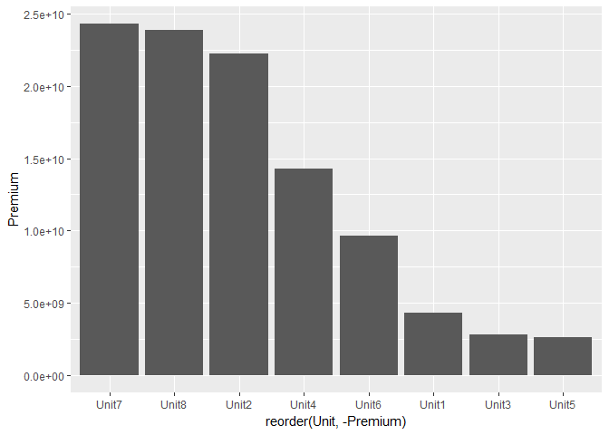
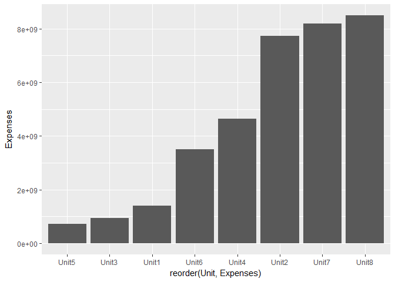
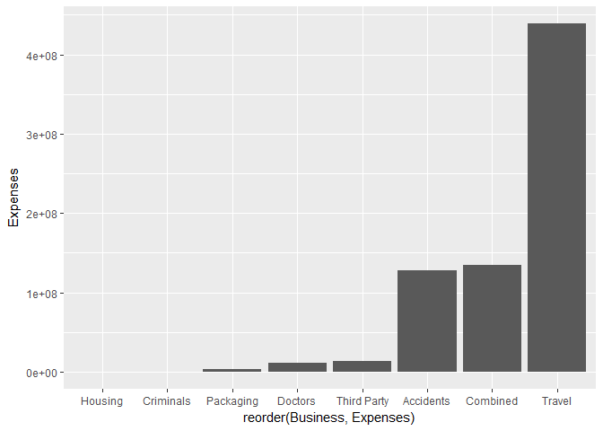

Data preparation for lesson 2 (KPI's, searching for bad looking portfolios)
================

``` r
# libraries
library(dplyr)
```

    ## 
    ## Attaching package: 'dplyr'

    ## The following objects are masked from 'package:stats':
    ## 
    ##     filter, lag

    ## The following objects are masked from 'package:base':
    ## 
    ##     intersect, setdiff, setequal, union

``` r
library(ggplot2)

# load data
setwd("D:\\GeneralInsurance_Class\\")
dt_KPI_raw <- read.csv("./Data/lesson2_KPI.csv")
```

#### What type of information do we have?

> Hint: To have a quick overview of data use glimpse() function from dplyr

``` r
dt_KPI_raw %>% glimpse()
```

    ## Observations: 1,101
    ## Variables: 9
    ## $ Region    <fctr> Alandia, Alandia, Alandia, Alandia, Alandia, Alandi...
    ## $ Unit      <fctr> Unit1, Unit1, Unit1, Unit1, Unit1, Unit1, Unit1, Un...
    ## $ Segment   <fctr> Big, Big, Big, Big, Big, Big, Big, Big, Big, Big, B...
    ## $ Business  <fctr> Doctors, Doctors, Criminals, Criminals, Third Party...
    ## $ Year      <int> 2012, 2013, 2012, 2013, 2012, 2013, 2012, 2013, 2012...
    ## $ Losses    <dbl> 0.0, 0.0, 0.0, 0.0, 3261073.0, 0.0, 479087.2, 0.0, 0...
    ## $ Expenses  <dbl> -38128.56, 0.00, 140694.65, 0.00, 1217174.71, 178993...
    ## $ Premium   <dbl> 0.0, 0.0, 0.0, 0.0, 5079637.0, 5169344.6, 648345.2, ...
    ## $ UWR.Plan. <dbl> 0.00, 0.00, 0.00, 0.00, 0.00, 122975.69, 0.00, 39516...

It is good to know what your data contains and what the column names mean, usually Data Governance team could help you with this question. For now let's assume we know what our columns mean.

##### What do the columns contain?

> Hint: The function summary() might help you to answer this question

``` r
summary(dt_KPI_raw)
```

    ##       Region         Unit      Segment           Business        Year     
    ##          :215          :215        :215              :215   Min.   :2012  
    ##  Alandia :339   Unit8  :128   Big  :529   Housing    : 97   1st Qu.:2013  
    ##  Belandia:213   Unit2  :119   Small:357   Travel     : 97   Median :2014  
    ##  Cergo   :334   Unit4  :117               Third Party: 96   Mean   :2014  
    ##                 Unit6  :117               Packaging  : 95   3rd Qu.:2015  
    ##                 Unit7  :116               (Other)    :310   Max.   :2016  
    ##                 (Other):289               NA's       :191   NA's   :215   
    ##      Losses             Expenses            Premium          
    ##  Min.   : -9092656   Min.   :-72120148   Min.   :  -3631017  
    ##  1st Qu.:        0   1st Qu.:        0   1st Qu.:         0  
    ##  Median :   900380   Median :  4787344   Median :  12745263  
    ##  Mean   : 37749573   Mean   : 41341279   Mean   : 120686400  
    ##  3rd Qu.: 28659645   3rd Qu.: 35100835   3rd Qu.: 108273340  
    ##  Max.   :714254063   Max.   :934250718   Max.   :2273357874  
    ##  NA's   :215         NA's   :215         NA's   :215         
    ##    UWR.Plan.        
    ##  Min.   :-54316456  
    ##  1st Qu.:        0  
    ##  Median :    41852  
    ##  Mean   :  2693978  
    ##  3rd Qu.:  1816444  
    ##  Max.   :139925504  
    ##  NA's   :215

See if there are completely blank rows or if it is there any valueable info.

``` r
dt_KPI_raw[is.na(dt_KPI_raw$Premium) & is.na(dt_KPI_raw$Losses), ] # using not dplyr approach
```

    ##      Region Unit Segment Business Year Losses Expenses Premium UWR.Plan.
    ## 887                                 NA     NA       NA      NA        NA
    ## 888                                 NA     NA       NA      NA        NA
    ## 889                                 NA     NA       NA      NA        NA
    ## 890                                 NA     NA       NA      NA        NA
    ## 891                                 NA     NA       NA      NA        NA
    ## 892                                 NA     NA       NA      NA        NA
    ## 893                                 NA     NA       NA      NA        NA
    ## 894                                 NA     NA       NA      NA        NA
    ## 895                                 NA     NA       NA      NA        NA
    ## 896                                 NA     NA       NA      NA        NA
    ## 897                                 NA     NA       NA      NA        NA
    ## 898                                 NA     NA       NA      NA        NA
    ## 899                                 NA     NA       NA      NA        NA
    ## 900                                 NA     NA       NA      NA        NA
    ## 901                                 NA     NA       NA      NA        NA
    ## 902                                 NA     NA       NA      NA        NA
    ## 903                                 NA     NA       NA      NA        NA
    ## 904                                 NA     NA       NA      NA        NA
    ## 905                                 NA     NA       NA      NA        NA
    ## 906                                 NA     NA       NA      NA        NA
    ## 907                                 NA     NA       NA      NA        NA
    ## 908                                 NA     NA       NA      NA        NA
    ## 909                                 NA     NA       NA      NA        NA
    ## 910                                 NA     NA       NA      NA        NA
    ## 911                                 NA     NA       NA      NA        NA
    ## 912                                 NA     NA       NA      NA        NA
    ## 913                                 NA     NA       NA      NA        NA
    ## 914                                 NA     NA       NA      NA        NA
    ## 915                                 NA     NA       NA      NA        NA
    ## 916                                 NA     NA       NA      NA        NA
    ## 917                                 NA     NA       NA      NA        NA
    ## 918                                 NA     NA       NA      NA        NA
    ## 919                                 NA     NA       NA      NA        NA
    ## 920                                 NA     NA       NA      NA        NA
    ## 921                                 NA     NA       NA      NA        NA
    ## 922                                 NA     NA       NA      NA        NA
    ## 923                                 NA     NA       NA      NA        NA
    ## 924                                 NA     NA       NA      NA        NA
    ## 925                                 NA     NA       NA      NA        NA
    ## 926                                 NA     NA       NA      NA        NA
    ## 927                                 NA     NA       NA      NA        NA
    ## 928                                 NA     NA       NA      NA        NA
    ## 929                                 NA     NA       NA      NA        NA
    ## 930                                 NA     NA       NA      NA        NA
    ## 931                                 NA     NA       NA      NA        NA
    ## 932                                 NA     NA       NA      NA        NA
    ## 933                                 NA     NA       NA      NA        NA
    ## 934                                 NA     NA       NA      NA        NA
    ## 935                                 NA     NA       NA      NA        NA
    ## 936                                 NA     NA       NA      NA        NA
    ## 937                                 NA     NA       NA      NA        NA
    ## 938                                 NA     NA       NA      NA        NA
    ## 939                                 NA     NA       NA      NA        NA
    ## 940                                 NA     NA       NA      NA        NA
    ## 941                                 NA     NA       NA      NA        NA
    ## 942                                 NA     NA       NA      NA        NA
    ## 943                                 NA     NA       NA      NA        NA
    ## 944                                 NA     NA       NA      NA        NA
    ## 945                                 NA     NA       NA      NA        NA
    ## 946                                 NA     NA       NA      NA        NA
    ## 947                                 NA     NA       NA      NA        NA
    ## 948                                 NA     NA       NA      NA        NA
    ## 949                                 NA     NA       NA      NA        NA
    ## 950                                 NA     NA       NA      NA        NA
    ## 951                                 NA     NA       NA      NA        NA
    ## 952                                 NA     NA       NA      NA        NA
    ## 953                                 NA     NA       NA      NA        NA
    ## 954                                 NA     NA       NA      NA        NA
    ## 955                                 NA     NA       NA      NA        NA
    ## 956                                 NA     NA       NA      NA        NA
    ## 957                                 NA     NA       NA      NA        NA
    ## 958                                 NA     NA       NA      NA        NA
    ## 959                                 NA     NA       NA      NA        NA
    ## 960                                 NA     NA       NA      NA        NA
    ## 961                                 NA     NA       NA      NA        NA
    ## 962                                 NA     NA       NA      NA        NA
    ## 963                                 NA     NA       NA      NA        NA
    ## 964                                 NA     NA       NA      NA        NA
    ## 965                                 NA     NA       NA      NA        NA
    ## 966                                 NA     NA       NA      NA        NA
    ## 967                                 NA     NA       NA      NA        NA
    ## 968                                 NA     NA       NA      NA        NA
    ## 969                                 NA     NA       NA      NA        NA
    ## 970                                 NA     NA       NA      NA        NA
    ## 971                                 NA     NA       NA      NA        NA
    ## 972                                 NA     NA       NA      NA        NA
    ## 973                                 NA     NA       NA      NA        NA
    ## 974                                 NA     NA       NA      NA        NA
    ## 975                                 NA     NA       NA      NA        NA
    ## 976                                 NA     NA       NA      NA        NA
    ## 977                                 NA     NA       NA      NA        NA
    ## 978                                 NA     NA       NA      NA        NA
    ## 979                                 NA     NA       NA      NA        NA
    ## 980                                 NA     NA       NA      NA        NA
    ## 981                                 NA     NA       NA      NA        NA
    ## 982                                 NA     NA       NA      NA        NA
    ## 983                                 NA     NA       NA      NA        NA
    ## 984                                 NA     NA       NA      NA        NA
    ## 985                                 NA     NA       NA      NA        NA
    ## 986                                 NA     NA       NA      NA        NA
    ## 987                                 NA     NA       NA      NA        NA
    ## 988                                 NA     NA       NA      NA        NA
    ## 989                                 NA     NA       NA      NA        NA
    ## 990                                 NA     NA       NA      NA        NA
    ## 991                                 NA     NA       NA      NA        NA
    ## 992                                 NA     NA       NA      NA        NA
    ## 993                                 NA     NA       NA      NA        NA
    ## 994                                 NA     NA       NA      NA        NA
    ## 995                                 NA     NA       NA      NA        NA
    ## 996                                 NA     NA       NA      NA        NA
    ## 997                                 NA     NA       NA      NA        NA
    ## 998                                 NA     NA       NA      NA        NA
    ## 999                                 NA     NA       NA      NA        NA
    ## 1000                                NA     NA       NA      NA        NA
    ## 1001                                NA     NA       NA      NA        NA
    ## 1002                                NA     NA       NA      NA        NA
    ## 1003                                NA     NA       NA      NA        NA
    ## 1004                                NA     NA       NA      NA        NA
    ## 1005                                NA     NA       NA      NA        NA
    ## 1006                                NA     NA       NA      NA        NA
    ## 1007                                NA     NA       NA      NA        NA
    ## 1008                                NA     NA       NA      NA        NA
    ## 1009                                NA     NA       NA      NA        NA
    ## 1010                                NA     NA       NA      NA        NA
    ## 1011                                NA     NA       NA      NA        NA
    ## 1012                                NA     NA       NA      NA        NA
    ## 1013                                NA     NA       NA      NA        NA
    ## 1014                                NA     NA       NA      NA        NA
    ## 1015                                NA     NA       NA      NA        NA
    ## 1016                                NA     NA       NA      NA        NA
    ## 1017                                NA     NA       NA      NA        NA
    ## 1018                                NA     NA       NA      NA        NA
    ## 1019                                NA     NA       NA      NA        NA
    ## 1020                                NA     NA       NA      NA        NA
    ## 1021                                NA     NA       NA      NA        NA
    ## 1022                                NA     NA       NA      NA        NA
    ## 1023                                NA     NA       NA      NA        NA
    ## 1024                                NA     NA       NA      NA        NA
    ## 1025                                NA     NA       NA      NA        NA
    ## 1026                                NA     NA       NA      NA        NA
    ## 1027                                NA     NA       NA      NA        NA
    ## 1028                                NA     NA       NA      NA        NA
    ## 1029                                NA     NA       NA      NA        NA
    ## 1030                                NA     NA       NA      NA        NA
    ## 1031                                NA     NA       NA      NA        NA
    ## 1032                                NA     NA       NA      NA        NA
    ## 1033                                NA     NA       NA      NA        NA
    ## 1034                                NA     NA       NA      NA        NA
    ## 1035                                NA     NA       NA      NA        NA
    ## 1036                                NA     NA       NA      NA        NA
    ## 1037                                NA     NA       NA      NA        NA
    ## 1038                                NA     NA       NA      NA        NA
    ## 1039                                NA     NA       NA      NA        NA
    ## 1040                                NA     NA       NA      NA        NA
    ## 1041                                NA     NA       NA      NA        NA
    ## 1042                                NA     NA       NA      NA        NA
    ## 1043                                NA     NA       NA      NA        NA
    ## 1044                                NA     NA       NA      NA        NA
    ## 1045                                NA     NA       NA      NA        NA
    ## 1046                                NA     NA       NA      NA        NA
    ## 1047                                NA     NA       NA      NA        NA
    ## 1048                                NA     NA       NA      NA        NA
    ## 1049                                NA     NA       NA      NA        NA
    ## 1050                                NA     NA       NA      NA        NA
    ## 1051                                NA     NA       NA      NA        NA
    ## 1052                                NA     NA       NA      NA        NA
    ## 1053                                NA     NA       NA      NA        NA
    ## 1054                                NA     NA       NA      NA        NA
    ## 1055                                NA     NA       NA      NA        NA
    ## 1056                                NA     NA       NA      NA        NA
    ## 1057                                NA     NA       NA      NA        NA
    ## 1058                                NA     NA       NA      NA        NA
    ## 1059                                NA     NA       NA      NA        NA
    ## 1060                                NA     NA       NA      NA        NA
    ## 1061                                NA     NA       NA      NA        NA
    ## 1062                                NA     NA       NA      NA        NA
    ## 1063                                NA     NA       NA      NA        NA
    ## 1064                                NA     NA       NA      NA        NA
    ## 1065                                NA     NA       NA      NA        NA
    ## 1066                                NA     NA       NA      NA        NA
    ## 1067                                NA     NA       NA      NA        NA
    ## 1068                                NA     NA       NA      NA        NA
    ## 1069                                NA     NA       NA      NA        NA
    ## 1070                                NA     NA       NA      NA        NA
    ## 1071                                NA     NA       NA      NA        NA
    ## 1072                                NA     NA       NA      NA        NA
    ## 1073                                NA     NA       NA      NA        NA
    ## 1074                                NA     NA       NA      NA        NA
    ## 1075                                NA     NA       NA      NA        NA
    ## 1076                                NA     NA       NA      NA        NA
    ## 1077                                NA     NA       NA      NA        NA
    ## 1078                                NA     NA       NA      NA        NA
    ## 1079                                NA     NA       NA      NA        NA
    ## 1080                                NA     NA       NA      NA        NA
    ## 1081                                NA     NA       NA      NA        NA
    ## 1082                                NA     NA       NA      NA        NA
    ## 1083                                NA     NA       NA      NA        NA
    ## 1084                                NA     NA       NA      NA        NA
    ## 1085                                NA     NA       NA      NA        NA
    ## 1086                                NA     NA       NA      NA        NA
    ## 1087                                NA     NA       NA      NA        NA
    ## 1088                                NA     NA       NA      NA        NA
    ## 1089                                NA     NA       NA      NA        NA
    ## 1090                                NA     NA       NA      NA        NA
    ## 1091                                NA     NA       NA      NA        NA
    ## 1092                                NA     NA       NA      NA        NA
    ## 1093                                NA     NA       NA      NA        NA
    ## 1094                                NA     NA       NA      NA        NA
    ## 1095                                NA     NA       NA      NA        NA
    ## 1096                                NA     NA       NA      NA        NA
    ## 1097                                NA     NA       NA      NA        NA
    ## 1098                                NA     NA       NA      NA        NA
    ## 1099                                NA     NA       NA      NA        NA
    ## 1100                                NA     NA       NA      NA        NA
    ## 1101                                NA     NA       NA      NA        NA

Completely blank, so lets remove them.

``` r
dt_KPI_raw <- dt_KPI_raw %>% filter(!is.na(Premium))
```

#### Looking for defects in data

##### Are there any missing values?

As a first task, try to find missings for a specific column only

``` r
dt_KPI_raw$Business %>% is.na %>% table
```

    ## .
    ## FALSE  TRUE 
    ##   695   191

Can you generalize this process for the whole dataset? &gt; Hint: Can you use any kind of loop here?

``` r
dt_KPI_raw %>% lapply(function(x) {is.na(x) %>% table}) 
```

    ## $Region
    ## .
    ## FALSE 
    ##   886 
    ## 
    ## $Unit
    ## .
    ## FALSE 
    ##   886 
    ## 
    ## $Segment
    ## .
    ## FALSE 
    ##   886 
    ## 
    ## $Business
    ## .
    ## FALSE  TRUE 
    ##   695   191 
    ## 
    ## $Year
    ## .
    ## FALSE 
    ##   886 
    ## 
    ## $Losses
    ## .
    ## FALSE 
    ##   886 
    ## 
    ## $Expenses
    ## .
    ## FALSE 
    ##   886 
    ## 
    ## $Premium
    ## .
    ## FALSE 
    ##   886 
    ## 
    ## $UWR.Plan.
    ## .
    ## FALSE 
    ##   886

Are there any values that don't make any sense in the context of the data? Which vaules are not allowed for specific columns? Let's have a look at individual columns. &gt; Hint: Be prepared to deal with continuous and categorical values as well

``` r
dt_KPI_raw %>% filter(Premium >= 0)
```

    ##       Region  Unit Segment    Business Year        Losses      Expenses
    ## 1    Alandia Unit1     Big     Doctors 2012  0.000000e+00 -3.812856e+04
    ## 2    Alandia Unit1     Big     Doctors 2013  0.000000e+00  0.000000e+00
    ## 3    Alandia Unit1     Big   Criminals 2012  0.000000e+00  1.406946e+05
    ## 4    Alandia Unit1     Big   Criminals 2013  0.000000e+00  0.000000e+00
    ## 5    Alandia Unit1     Big Third Party 2012  3.261073e+06  1.217175e+06
    ## 6    Alandia Unit1     Big Third Party 2013  0.000000e+00  1.789936e+06
    ## 7    Alandia Unit1     Big   Packaging 2012  4.790872e+05  2.022069e+05
    ## 8    Alandia Unit1     Big   Packaging 2013  0.000000e+00  6.744924e+04
    ## 9    Alandia Unit1     Big      Travel 2012  0.000000e+00  0.000000e+00
    ## 10   Alandia Unit1     Big      Travel 2013  0.000000e+00 -4.622371e+05
    ## 11   Alandia Unit1     Big        <NA> 2012  0.000000e+00  0.000000e+00
    ## 12   Alandia Unit1     Big        <NA> 2013  0.000000e+00  0.000000e+00
    ## 13   Alandia Unit1     Big        <NA> 2012  5.493296e+05 -5.823142e+05
    ## 14   Alandia Unit1     Big        <NA> 2013  0.000000e+00 -1.694879e+05
    ## 15   Alandia Unit1     Big    Combined 2012  0.000000e+00  0.000000e+00
    ## 16   Alandia Unit1     Big    Combined 2013  0.000000e+00  0.000000e+00
    ## 17   Alandia Unit1     Big     Housing 2012  5.443468e+06  1.525101e+06
    ## 18   Alandia Unit1     Big     Housing 2013  0.000000e+00  2.487201e+06
    ## 19   Alandia Unit1     Big   Accidents 2012  0.000000e+00  0.000000e+00
    ## 20   Alandia Unit1     Big   Accidents 2013  0.000000e+00  0.000000e+00
    ## 21   Alandia Unit1     Big     Doctors 2012  1.437446e+06  2.522140e+06
    ## 22   Alandia Unit1     Big     Doctors 2013  2.048090e+06  2.759065e+06
    ## 23   Alandia Unit1     Big     Doctors 2014  1.705493e+06  2.679480e+06
    ## 24   Alandia Unit1     Big     Doctors 2015  3.386873e+06  3.586483e+06
    ## 25   Alandia Unit1     Big     Doctors 2016  0.000000e+00  1.715686e+06
    ## 26   Alandia Unit1     Big   Criminals 2012  0.000000e+00  0.000000e+00
    ## 27   Alandia Unit1     Big   Criminals 2013  0.000000e+00  0.000000e+00
    ## 28   Alandia Unit1     Big   Criminals 2014  0.000000e+00  2.138103e-02
    ## 29   Alandia Unit1     Big Third Party 2012  1.866793e+07  1.768807e+07
    ## 30   Alandia Unit1     Big Third Party 2013  2.665559e+07  2.191905e+07
    ## 31   Alandia Unit1     Big Third Party 2014  1.930908e+07  2.265942e+07
    ## 32   Alandia Unit1     Big Third Party 2015  1.855737e+07  2.495005e+07
    ## 33   Alandia Unit1     Big Third Party 2016  0.000000e+00  1.381038e+07
    ## 34   Alandia Unit1     Big   Packaging 2012  5.270226e+06  5.641337e+06
    ## 35   Alandia Unit1     Big   Packaging 2013  6.071770e+06  6.058273e+06
    ## 36   Alandia Unit1     Big   Packaging 2014  5.315325e+06  7.846124e+06
    ## 37   Alandia Unit1     Big   Packaging 2015  7.061044e+06  7.952298e+06
    ## 38   Alandia Unit1     Big   Packaging 2016  0.000000e+00  3.859486e+06
    ## 39   Alandia Unit1     Big      Travel 2012  4.347268e+07  3.042471e+07
    ## 40   Alandia Unit1     Big      Travel 2013  4.928735e+07  3.383757e+07
    ## 41   Alandia Unit1     Big      Travel 2014  4.369979e+07  3.669102e+07
    ## 42   Alandia Unit1     Big      Travel 2015  4.196143e+07  4.101369e+07
    ## 43   Alandia Unit1     Big      Travel 2016  0.000000e+00  2.043892e+07
    ## 44   Alandia Unit1     Big        <NA> 2012  0.000000e+00  0.000000e+00
    ## 45   Alandia Unit1     Big        <NA> 2013  0.000000e+00  0.000000e+00
    ## 46   Alandia Unit1     Big        <NA> 2014  0.000000e+00 -2.770773e+00
    ## 47   Alandia Unit1     Big        <NA> 2015  0.000000e+00  7.466881e+04
    ## 48   Alandia Unit1     Big        <NA> 2016  0.000000e+00  0.000000e+00
    ## 49   Alandia Unit1     Big        <NA> 2012  1.085211e+07  1.145996e+07
    ## 50   Alandia Unit1     Big        <NA> 2013  1.243622e+07  1.399327e+07
    ## 51   Alandia Unit1     Big        <NA> 2014  1.522597e+07  1.644429e+07
    ## 52   Alandia Unit1     Big        <NA> 2015  1.275185e+07  1.787797e+07
    ## 53   Alandia Unit1     Big        <NA> 2016  0.000000e+00  8.238658e+06
    ## 54   Alandia Unit1     Big    Combined 2012  0.000000e+00  0.000000e+00
    ## 55   Alandia Unit1     Big    Combined 2013  0.000000e+00  0.000000e+00
    ## 56   Alandia Unit1     Big     Housing 2012  3.531796e+07  2.972487e+07
    ## 57   Alandia Unit1     Big     Housing 2013  3.763622e+07  3.573159e+07
    ## 58   Alandia Unit1     Big     Housing 2014  3.157968e+07  3.785814e+07
    ## 59   Alandia Unit1     Big     Housing 2015  3.005292e+07  3.968544e+07
    ## 60   Alandia Unit1     Big     Housing 2016  0.000000e+00  2.109179e+07
    ## 61   Alandia Unit1     Big   Accidents 2012  0.000000e+00  0.000000e+00
    ## 62   Alandia Unit1     Big   Accidents 2013  0.000000e+00  0.000000e+00
    ## 63   Alandia Unit1   Small     Doctors 2012  1.998841e+07  2.413651e+07
    ## 64   Alandia Unit1   Small     Doctors 2013  2.397144e+07  2.870409e+07
    ## 65   Alandia Unit1   Small     Doctors 2014  2.611374e+07  2.934437e+07
    ## 66   Alandia Unit1   Small     Doctors 2015  2.835626e+07  3.616437e+07
    ## 67   Alandia Unit1   Small     Doctors 2016  3.204509e+07  3.892744e+07
    ## 68   Alandia Unit1   Small   Criminals 2012  0.000000e+00  0.000000e+00
    ## 69   Alandia Unit1   Small   Criminals 2013  0.000000e+00  0.000000e+00
    ## 70   Alandia Unit1   Small   Criminals 2014  0.000000e+00 -4.303504e-02
    ## 71   Alandia Unit1   Small Third Party 2012  1.527835e+06  3.585313e+06
    ## 72   Alandia Unit1   Small Third Party 2013  1.393036e+06  3.674620e+06
    ## 73   Alandia Unit1   Small Third Party 2014  1.590498e+06  4.176745e+06
    ## 74   Alandia Unit1   Small Third Party 2015  1.360954e+06  4.074629e+06
    ## 75   Alandia Unit1   Small Third Party 2016  1.720755e+07  1.597443e+07
    ## 76   Alandia Unit1   Small   Packaging 2012  3.465892e+05  5.676222e+05
    ## 77   Alandia Unit1   Small   Packaging 2013  3.083997e+05  8.967143e+05
    ## 78   Alandia Unit1   Small   Packaging 2014  1.185659e+05  6.407319e+05
    ## 79   Alandia Unit1   Small   Packaging 2015  8.601526e+04  2.922946e+05
    ## 80   Alandia Unit1   Small   Packaging 2016  5.663980e+06  4.254443e+06
    ## 81   Alandia Unit1   Small      Travel 2012  9.759600e+07  8.014648e+07
    ## 82   Alandia Unit1   Small      Travel 2013  1.056372e+08  8.438694e+07
    ## 83   Alandia Unit1   Small      Travel 2014  9.792232e+07  9.472330e+07
    ## 84   Alandia Unit1   Small      Travel 2015  1.057724e+08  1.095624e+08
    ## 85   Alandia Unit1   Small      Travel 2016  1.528253e+08  1.214506e+08
    ## 86   Alandia Unit1   Small        <NA> 2012  0.000000e+00  0.000000e+00
    ## 87   Alandia Unit1   Small        <NA> 2013  0.000000e+00  3.425467e-02
    ## 88   Alandia Unit1   Small        <NA> 2014  0.000000e+00  8.128154e-01
    ## 89   Alandia Unit1   Small        <NA> 2015  0.000000e+00  1.304339e+05
    ## 90   Alandia Unit1   Small        <NA> 2016  0.000000e+00  0.000000e+00
    ## 91   Alandia Unit1   Small        <NA> 2012  9.593149e+06  1.233226e+07
    ## 92   Alandia Unit1   Small        <NA> 2013  1.115677e+07  1.381360e+07
    ## 93   Alandia Unit1   Small        <NA> 2014  1.372648e+07  1.766598e+07
    ## 94   Alandia Unit1   Small        <NA> 2015  1.575729e+07  1.870923e+07
    ## 95   Alandia Unit1   Small        <NA> 2016  2.876077e+07  2.823764e+07
    ## 96   Alandia Unit1   Small    Combined 2012  0.000000e+00  0.000000e+00
    ## 97   Alandia Unit1   Small    Combined 2013  0.000000e+00  0.000000e+00
    ## 98   Alandia Unit1   Small     Housing 2012  3.680844e+07  3.545029e+07
    ## 99   Alandia Unit1   Small     Housing 2013  3.733793e+07  4.078873e+07
    ## 100  Alandia Unit1   Small     Housing 2014  3.192107e+07  4.135469e+07
    ## 101  Alandia Unit1   Small     Housing 2015  3.881469e+07  4.536015e+07
    ## 102  Alandia Unit1   Small     Housing 2016  6.340630e+07  6.541877e+07
    ## 103  Alandia Unit1   Small   Accidents 2012  0.000000e+00  0.000000e+00
    ## 104  Alandia Unit1   Small   Accidents 2013  0.000000e+00  0.000000e+00
    ## 105  Alandia Unit2     Big     Doctors 2012  1.275903e+06  1.269244e+06
    ## 106  Alandia Unit2     Big     Doctors 2013  0.000000e+00  5.458091e+05
    ## 107  Alandia Unit2     Big     Doctors 2016  1.440502e+06  4.174700e+05
    ## 108  Alandia Unit2     Big   Criminals 2012  0.000000e+00  0.000000e+00
    ## 109  Alandia Unit2     Big   Criminals 2013  0.000000e+00  0.000000e+00
    ## 110  Alandia Unit2     Big   Criminals 2016  3.583855e+07  3.443835e+07
    ## 111  Alandia Unit2     Big Third Party 2012  6.089774e+07  4.741394e+07
    ## 112  Alandia Unit2     Big Third Party 2013  0.000000e+00  2.566996e+07
    ## 113  Alandia Unit2     Big Third Party 2016  1.090592e+08  3.638726e+07
    ## 114  Alandia Unit2     Big   Packaging 2012  4.487179e+07  2.601467e+07
    ## 115  Alandia Unit2     Big   Packaging 2013  0.000000e+00  1.602066e+07
    ## 116  Alandia Unit2     Big   Packaging 2016  2.642489e+07  1.155945e+07
    ## 117  Alandia Unit2     Big      Travel 2012  1.225839e+08  3.733674e+07
    ## 118  Alandia Unit2     Big      Travel 2013  0.000000e+00  2.120968e+07
    ## 119  Alandia Unit2     Big      Travel 2016  6.629112e+07  2.064713e+07
    ## 120  Alandia Unit2     Big        <NA> 2012  0.000000e+00  0.000000e+00
    ## 121  Alandia Unit2     Big        <NA> 2013  0.000000e+00  0.000000e+00
    ## 122  Alandia Unit2     Big        <NA> 2016  0.000000e+00  0.000000e+00
    ## 123  Alandia Unit2     Big        <NA> 2012  5.131791e+04 -7.688769e+06
    ## 124  Alandia Unit2     Big        <NA> 2013  0.000000e+00  2.071562e+05
    ## 125  Alandia Unit2     Big        <NA> 2016  0.000000e+00 -5.665372e+05
    ## 126  Alandia Unit2     Big    Combined 2012  0.000000e+00  0.000000e+00
    ## 127  Alandia Unit2     Big    Combined 2013  0.000000e+00  0.000000e+00
    ## 128  Alandia Unit2     Big     Housing 2012  9.293763e+07  5.560475e+07
    ## 129  Alandia Unit2     Big     Housing 2013  0.000000e+00  2.563102e+07
    ## 130  Alandia Unit2     Big     Housing 2016  1.217180e+08  3.548603e+07
    ## 131  Alandia Unit2     Big   Accidents 2012  0.000000e+00  0.000000e+00
    ## 132  Alandia Unit2     Big   Accidents 2013  0.000000e+00  0.000000e+00
    ## 133  Alandia Unit2     Big   Accidents 2016  9.342438e+02  9.509199e+03
    ## 134  Alandia Unit2     Big     Doctors 2012  9.938244e+06  1.235425e+07
    ## 135  Alandia Unit2     Big     Doctors 2013  9.345300e+06  1.020878e+07
    ## 136  Alandia Unit2     Big     Doctors 2014  8.447026e+06  1.000461e+07
    ## 137  Alandia Unit2     Big     Doctors 2015  9.219818e+06  1.143268e+07
    ## 138  Alandia Unit2     Big     Doctors 2016  0.000000e+00  6.189495e+06
    ## 139  Alandia Unit2     Big   Criminals 2012  3.925411e+07  9.939700e+07
    ## 140  Alandia Unit2     Big   Criminals 2013  1.185593e+08  8.281517e+07
    ## 141  Alandia Unit2     Big   Criminals 2014  5.089527e+07  6.273171e+07
    ## 142  Alandia Unit2     Big   Criminals 2015  1.049057e+08  8.255784e+07
    ## 143  Alandia Unit2     Big   Criminals 2016  0.000000e+00  2.773481e+07
    ## 144  Alandia Unit2     Big Third Party 2012  1.453950e+08  1.474019e+08
    ## 145  Alandia Unit2     Big Third Party 2013  6.694956e+07  1.149155e+08
    ## 146  Alandia Unit2     Big Third Party 2014  6.354432e+07  1.246395e+08
    ## 147  Alandia Unit2     Big Third Party 2015  6.788746e+07  1.384938e+08
    ## 148  Alandia Unit2     Big Third Party 2016  0.000000e+00  6.642122e+07
    ## 149  Alandia Unit2     Big   Packaging 2012  3.877763e+07  3.979873e+07
    ## 150  Alandia Unit2     Big   Packaging 2013  4.020662e+07  3.838062e+07
    ## 151  Alandia Unit2     Big   Packaging 2014  2.511820e+07  3.122599e+07
    ## 152  Alandia Unit2     Big   Packaging 2015  2.069336e+07  2.858187e+07
    ## 153  Alandia Unit2     Big   Packaging 2016  0.000000e+00  1.455079e+07
    ## 154  Alandia Unit2     Big      Travel 2012  1.629086e+08  1.313118e+08
    ## 155  Alandia Unit2     Big      Travel 2013  1.185330e+08  1.060533e+08
    ## 156  Alandia Unit2     Big      Travel 2014  9.752216e+07  9.241377e+07
    ## 157  Alandia Unit2     Big      Travel 2015  1.155100e+08  1.153343e+08
    ## 158  Alandia Unit2     Big      Travel 2016  0.000000e+00  5.973585e+07
    ## 159  Alandia Unit2     Big        <NA> 2012  0.000000e+00  0.000000e+00
    ## 160  Alandia Unit2     Big        <NA> 2013  0.000000e+00  1.155691e-02
    ## 161  Alandia Unit2     Big        <NA> 2014  0.000000e+00 -1.746525e+07
    ## 162  Alandia Unit2     Big        <NA> 2015  0.000000e+00  2.929334e+05
    ## 163  Alandia Unit2     Big        <NA> 2016  0.000000e+00  0.000000e+00
    ## 164  Alandia Unit2     Big        <NA> 2012  9.835413e+06 -7.951212e+06
    ## 165  Alandia Unit2     Big        <NA> 2013  5.025921e+07  4.350108e+07
    ## 166  Alandia Unit2     Big        <NA> 2014  4.678687e+07  6.459045e+07
    ## 167  Alandia Unit2     Big        <NA> 2015  4.301023e+07  4.439125e+07
    ## 168  Alandia Unit2     Big        <NA> 2016  0.000000e+00  2.464385e+07
    ## 169  Alandia Unit2     Big    Combined 2012  0.000000e+00  0.000000e+00
    ## 170  Alandia Unit2     Big    Combined 2013  0.000000e+00  0.000000e+00
    ## 171  Alandia Unit2     Big     Housing 2012  1.393154e+08  1.598588e+08
    ## 172  Alandia Unit2     Big     Housing 2013  1.472268e+08  1.597755e+08
    ## 173  Alandia Unit2     Big     Housing 2014  1.113544e+08  1.533911e+08
    ## 174  Alandia Unit2     Big     Housing 2015  1.383533e+08  1.634296e+08
    ## 175  Alandia Unit2     Big     Housing 2016  0.000000e+00  8.935575e+07
    ## 176  Alandia Unit2     Big   Accidents 2012  0.000000e+00  0.000000e+00
    ## 177  Alandia Unit2     Big   Accidents 2013  0.000000e+00  0.000000e+00
    ## 178  Alandia Unit2     Big   Accidents 2016  0.000000e+00  2.747214e+06
    ## 179  Alandia Unit2   Small     Doctors 2012  6.594279e+07  2.111384e+08
    ## 180  Alandia Unit2   Small     Doctors 2013  7.193618e+07  1.717194e+08
    ## 181  Alandia Unit2   Small     Doctors 2014  8.620633e+07  1.713444e+08
    ## 182  Alandia Unit2   Small     Doctors 2015  8.362113e+07  1.898803e+08
    ## 183  Alandia Unit2   Small     Doctors 2016  8.890907e+07  1.886407e+08
    ## 184  Alandia Unit2   Small   Criminals 2012  6.289325e+04 -1.457549e+05
    ## 185  Alandia Unit2   Small   Criminals 2013  3.435065e+04  8.079360e+04
    ## 186  Alandia Unit2   Small   Criminals 2014  3.527346e+04  4.946892e+04
    ## 187  Alandia Unit2   Small   Criminals 2015  4.425764e+04  9.769619e+04
    ## 188  Alandia Unit2   Small   Criminals 2016  6.440737e+04  1.074909e+05
    ## 189  Alandia Unit2   Small Third Party 2012  2.617181e+07  8.161259e+07
    ## 190  Alandia Unit2   Small Third Party 2013  2.601525e+07  7.617166e+07
    ## 191  Alandia Unit2   Small Third Party 2014  2.443352e+07  8.078578e+07
    ## 192  Alandia Unit2   Small Third Party 2015  2.130744e+07  9.128072e+07
    ## 193  Alandia Unit2   Small Third Party 2016  8.647834e+07  1.333936e+08
    ## 194  Alandia Unit2   Small   Packaging 2012  7.449919e+05  7.175323e+04
    ## 195  Alandia Unit2   Small   Packaging 2013  8.152384e+05  2.582723e+06
    ## 196  Alandia Unit2   Small   Packaging 2014  6.705033e+05  2.277240e+06
    ## 197  Alandia Unit2   Small   Packaging 2015  2.138096e+05  2.348083e+06
    ## 198  Alandia Unit2   Small   Packaging 2016  1.471418e+07  1.702217e+07
    ## 199  Alandia Unit2   Small      Travel 2012  7.084141e+08  4.375298e+08
    ## 200  Alandia Unit2   Small      Travel 2013  6.589382e+08  4.497380e+08
    ## 201  Alandia Unit2   Small      Travel 2014  6.399456e+08  5.134984e+08
    ## 202  Alandia Unit2   Small      Travel 2015  6.589586e+08  5.399959e+08
    ## 203  Alandia Unit2   Small      Travel 2016  7.142541e+08  5.662550e+08
    ## 204  Alandia Unit2   Small        <NA> 2012  0.000000e+00  0.000000e+00
    ## 205  Alandia Unit2   Small        <NA> 2013  0.000000e+00 -2.179624e-02
    ## 206  Alandia Unit2   Small        <NA> 2014  0.000000e+00  1.393311e+05
    ## 207  Alandia Unit2   Small        <NA> 2015  0.000000e+00  9.032650e+05
    ## 208  Alandia Unit2   Small        <NA> 2016  0.000000e+00  0.000000e+00
    ## 209  Alandia Unit2   Small        <NA> 2012  4.791729e+07  1.736950e+07
    ## 210  Alandia Unit2   Small        <NA> 2013  5.038916e+07  6.521175e+07
    ## 211  Alandia Unit2   Small        <NA> 2014  5.056101e+07  1.276425e+08
    ## 212  Alandia Unit2   Small        <NA> 2015  5.629592e+07  8.041742e+07
    ## 213  Alandia Unit2   Small        <NA> 2016  1.038466e+08  1.089337e+08
    ## 214  Alandia Unit2   Small    Combined 2012  0.000000e+00  0.000000e+00
    ## 215  Alandia Unit2   Small    Combined 2013  0.000000e+00  0.000000e+00
    ## 216  Alandia Unit2   Small     Housing 2012  1.150425e+08  1.957872e+08
    ## 217  Alandia Unit2   Small     Housing 2013  1.372678e+08  1.539354e+08
    ## 218  Alandia Unit2   Small     Housing 2014  1.181856e+08  1.609143e+08
    ## 219  Alandia Unit2   Small     Housing 2015  1.298056e+08  1.923371e+08
    ## 220  Alandia Unit2   Small     Housing 2016  2.872295e+08  3.017538e+08
    ## 221  Alandia Unit2   Small   Accidents 2012  0.000000e+00  0.000000e+00
    ## 222  Alandia Unit2   Small   Accidents 2013  0.000000e+00  0.000000e+00
    ## 223  Alandia Unit2   Small   Accidents 2016  0.000000e+00  5.487202e+06
    ## 224 Belandia Unit3     Big     Doctors 2012  0.000000e+00  0.000000e+00
    ## 225 Belandia Unit3     Big     Doctors 2013  0.000000e+00  0.000000e+00
    ## 226 Belandia Unit3     Big     Doctors 2014  0.000000e+00  6.853551e+04
    ## 227 Belandia Unit3     Big   Criminals 2012  0.000000e+00  0.000000e+00
    ## 228 Belandia Unit3     Big   Criminals 2013  0.000000e+00  0.000000e+00
    ## 229 Belandia Unit3     Big   Criminals 2014  0.000000e+00  1.464926e+05
    ## 230 Belandia Unit3     Big Third Party 2012  1.725379e+07  1.079392e+07
    ## 231 Belandia Unit3     Big Third Party 2013  1.224185e+07  1.264326e+07
    ## 232 Belandia Unit3     Big Third Party 2014  1.350583e+07  1.348051e+07
    ## 233 Belandia Unit3     Big Third Party 2015  1.571902e+07  1.552407e+07
    ## 234 Belandia Unit3     Big Third Party 2016  0.000000e+00  8.962088e+06
    ## 235 Belandia Unit3     Big   Packaging 2012  2.051635e+05  7.829311e+05
    ## 236 Belandia Unit3     Big   Packaging 2013  2.555374e+05  8.731898e+05
    ## 237 Belandia Unit3     Big   Packaging 2014  2.316371e+05  6.341942e+05
    ## 238 Belandia Unit3     Big   Packaging 2015  1.224721e+05  7.990024e+05
    ## 239 Belandia Unit3     Big   Packaging 2016  0.000000e+00  3.692089e+05
    ## 240 Belandia Unit3     Big      Travel 2012  1.754978e+07  1.259565e+07
    ## 241 Belandia Unit3     Big      Travel 2013  1.564520e+07  1.228833e+07
    ## 242 Belandia Unit3     Big      Travel 2014  2.053731e+07  1.518377e+07
    ## 243 Belandia Unit3     Big      Travel 2015  2.987992e+07  2.092268e+07
    ## 244 Belandia Unit3     Big      Travel 2016  0.000000e+00  8.579470e+06
    ## 245 Belandia Unit3     Big        <NA> 2012  0.000000e+00  0.000000e+00
    ## 246 Belandia Unit3     Big        <NA> 2013  0.000000e+00  1.108640e-02
    ## 247 Belandia Unit3     Big        <NA> 2014  0.000000e+00 -1.290289e+02
    ## 248 Belandia Unit3     Big        <NA> 2015  0.000000e+00  2.256264e+02
    ## 249 Belandia Unit3     Big        <NA> 2016  0.000000e+00  0.000000e+00
    ## 250 Belandia Unit3     Big        <NA> 2012  9.363280e+06  3.566679e+06
    ## 251 Belandia Unit3     Big        <NA> 2013  5.565171e+05  6.632691e+06
    ## 252 Belandia Unit3     Big        <NA> 2014  5.432160e+06  8.203588e+06
    ## 253 Belandia Unit3     Big        <NA> 2015  0.000000e+00  7.423272e+00
    ## 254 Belandia Unit3     Big    Combined 2012  1.341575e+07  1.515370e+07
    ## 255 Belandia Unit3     Big    Combined 2013  1.878994e+07  1.629870e+07
    ## 256 Belandia Unit3     Big    Combined 2014  2.281900e+07  2.145353e+07
    ## 257 Belandia Unit3     Big    Combined 2015  2.128045e+07  2.441310e+07
    ## 258 Belandia Unit3     Big    Combined 2016  0.000000e+00  1.282563e+07
    ## 259 Belandia Unit3     Big     Housing 2012  1.340791e+07  2.657336e+07
    ## 260 Belandia Unit3     Big     Housing 2013  1.207012e+07  2.326087e+07
    ## 261 Belandia Unit3     Big     Housing 2014  1.026679e+07  2.621305e+07
    ## 262 Belandia Unit3     Big     Housing 2015  1.233317e+07  2.455106e+07
    ## 263 Belandia Unit3     Big     Housing 2016  0.000000e+00  1.169558e+07
    ## 264 Belandia Unit3     Big   Accidents 2012  1.956436e+07  1.074178e+07
    ## 265 Belandia Unit3     Big   Accidents 2013  1.500119e+07  1.303330e+07
    ## 266 Belandia Unit3     Big   Accidents 2014  1.661118e+07  1.370298e+07
    ## 267 Belandia Unit3     Big   Accidents 2015  1.567997e+07  1.397161e+07
    ## 268 Belandia Unit3     Big   Accidents 2016  0.000000e+00  6.550462e+06
    ## 269 Belandia Unit3   Small     Doctors 2012  0.000000e+00  0.000000e+00
    ## 270 Belandia Unit3   Small   Criminals 2012  0.000000e+00  0.000000e+00
    ## 271 Belandia Unit3   Small   Criminals 2013  0.000000e+00  0.000000e+00
    ## 272 Belandia Unit3   Small Third Party 2012  0.000000e+00  0.000000e+00
    ## 273 Belandia Unit3   Small Third Party 2013  0.000000e+00  0.000000e+00
    ## 274 Belandia Unit3   Small Third Party 2014  0.000000e+00 -4.893954e+04
    ## 275 Belandia Unit3   Small Third Party 2016  1.492354e+07  8.582997e+06
    ## 276 Belandia Unit3   Small   Packaging 2012  0.000000e+00  0.000000e+00
    ## 277 Belandia Unit3   Small   Packaging 2013  0.000000e+00  0.000000e+00
    ## 278 Belandia Unit3   Small   Packaging 2016  1.033418e+05  2.065643e+05
    ## 279 Belandia Unit3   Small      Travel 2012  9.638977e+07  5.915345e+07
    ## 280 Belandia Unit3   Small      Travel 2013  9.376287e+07  5.862065e+07
    ## 281 Belandia Unit3   Small      Travel 2014  7.515802e+07  5.255508e+07
    ## 282 Belandia Unit3   Small      Travel 2015  5.448964e+07  4.212655e+07
    ## 283 Belandia Unit3   Small      Travel 2016  8.017527e+07  5.454364e+07
    ## 284 Belandia Unit3   Small        <NA> 2012  0.000000e+00  0.000000e+00
    ## 285 Belandia Unit3   Small        <NA> 2013  0.000000e+00  0.000000e+00
    ## 286 Belandia Unit3   Small        <NA> 2014  0.000000e+00  2.074308e+00
    ## 287 Belandia Unit3   Small        <NA> 2015  0.000000e+00  1.409079e+02
    ## 288 Belandia Unit3   Small        <NA> 2016  0.000000e+00  0.000000e+00
    ## 289 Belandia Unit3   Small        <NA> 2012  9.199498e+05  1.983033e+06
    ## 290 Belandia Unit3   Small        <NA> 2013  7.639013e+06  6.784065e+06
    ## 291 Belandia Unit3   Small        <NA> 2014  3.828260e+06  7.910070e+06
    ## 292 Belandia Unit3   Small        <NA> 2015  4.071299e+06  6.065474e+06
    ## 293 Belandia Unit3   Small        <NA> 2016  4.791576e+06  9.845735e+06
    ## 294 Belandia Unit3   Small    Combined 2012  0.000000e+00  0.000000e+00
    ## 295 Belandia Unit3   Small    Combined 2013  0.000000e+00  0.000000e+00
    ## 296 Belandia Unit3   Small    Combined 2016  2.140285e+07  1.301364e+07
    ## 297 Belandia Unit3   Small     Housing 2012  2.947394e+07  3.943087e+07
    ## 298 Belandia Unit3   Small     Housing 2013  2.815857e+07  4.608841e+07
    ## 299 Belandia Unit3   Small     Housing 2014  4.132969e+07  5.038278e+07
    ## 300 Belandia Unit3   Small     Housing 2015  3.487022e+07  5.497890e+07
    ## 301 Belandia Unit3   Small     Housing 2016  4.537879e+07  6.184579e+07
    ## 302 Belandia Unit3   Small   Accidents 2012  0.000000e+00  0.000000e+00
    ## 303 Belandia Unit3   Small   Accidents 2013  0.000000e+00  0.000000e+00
    ## 304 Belandia Unit3   Small   Accidents 2016  1.461581e+07  6.692865e+06
    ## 305    Cergo Unit4     Big     Doctors 2012  9.885614e+06  7.693946e+06
    ## 306    Cergo Unit4     Big     Doctors 2013  0.000000e+00  3.632327e+06
    ## 307    Cergo Unit4     Big     Doctors 2016  8.124576e+06  3.031984e+06
    ## 308    Cergo Unit4     Big   Criminals 2012  8.783457e+05  6.299383e+05
    ## 309    Cergo Unit4     Big   Criminals 2013  0.000000e+00  4.928445e+05
    ## 310    Cergo Unit4     Big   Criminals 2016  1.989407e+06  1.304092e+06
    ## 311    Cergo Unit4     Big Third Party 2012  3.430588e+07  2.912529e+07
    ## 312    Cergo Unit4     Big Third Party 2013  0.000000e+00  1.597988e+07
    ## 313    Cergo Unit4     Big Third Party 2016  4.540747e+07  2.244267e+07
    ## 314    Cergo Unit4     Big   Packaging 2012  6.828654e+05  6.391859e+05
    ## 315    Cergo Unit4     Big   Packaging 2013  0.000000e+00  2.337793e+05
    ## 316    Cergo Unit4     Big   Packaging 2016  1.887609e+06  7.067985e+05
    ## 317    Cergo Unit4     Big      Travel 2012  2.285793e+07  1.270317e+07
    ## 318    Cergo Unit4     Big      Travel 2013  0.000000e+00  7.338492e+06
    ## 319    Cergo Unit4     Big      Travel 2016  1.596073e+07  6.039011e+06
    ## 320    Cergo Unit4     Big        <NA> 2012  0.000000e+00  0.000000e+00
    ## 321    Cergo Unit4     Big        <NA> 2013  0.000000e+00  0.000000e+00
    ## 322    Cergo Unit4     Big        <NA> 2012  2.416658e+05 -1.992857e+06
    ## 323    Cergo Unit4     Big        <NA> 2013  0.000000e+00 -4.537431e+04
    ## 324    Cergo Unit4     Big        <NA> 2016  4.977206e+03 -2.263738e+05
    ## 325    Cergo Unit4     Big    Combined 2012  0.000000e+00  0.000000e+00
    ## 326    Cergo Unit4     Big    Combined 2013  0.000000e+00  0.000000e+00
    ## 327    Cergo Unit4     Big     Housing 2012  1.783577e+07  1.077444e+07
    ## 328    Cergo Unit4     Big     Housing 2013  0.000000e+00  7.636255e+06
    ## 329    Cergo Unit4     Big     Housing 2016  6.302183e+06  6.350433e+06
    ## 330    Cergo Unit4     Big   Accidents 2012  0.000000e+00  0.000000e+00
    ## 331    Cergo Unit4     Big   Accidents 2013  0.000000e+00  0.000000e+00
    ## 332    Cergo Unit4     Big   Accidents 2016  0.000000e+00  7.416427e+04
    ## 333    Cergo Unit4     Big     Doctors 2012  1.612227e+07  1.446082e+07
    ## 334    Cergo Unit4     Big     Doctors 2013  1.749697e+07  1.805114e+07
    ## 335    Cergo Unit4     Big     Doctors 2014  1.882596e+07  2.013442e+07
    ## 336    Cergo Unit4     Big     Doctors 2015  2.830119e+07  2.813342e+07
    ## 337    Cergo Unit4     Big     Doctors 2016  0.000000e+00  1.482990e+07
    ## 338    Cergo Unit4     Big   Criminals 2012  1.079583e+07  1.433758e+07
    ## 339    Cergo Unit4     Big   Criminals 2013  1.061284e+07  1.070381e+07
    ## 340    Cergo Unit4     Big   Criminals 2014  1.005355e+07  1.181288e+07
    ## 341    Cergo Unit4     Big   Criminals 2015  9.147055e+06  9.882120e+06
    ## 342    Cergo Unit4     Big   Criminals 2016  0.000000e+00  3.670245e+06
    ## 343    Cergo Unit4     Big Third Party 2012  4.482162e+07  4.677818e+07
    ## 344    Cergo Unit4     Big Third Party 2013  4.361429e+07  5.319257e+07
    ## 345    Cergo Unit4     Big Third Party 2014  4.690194e+07  5.260926e+07
    ## 346    Cergo Unit4     Big Third Party 2015  4.441446e+07  5.309965e+07
    ## 347    Cergo Unit4     Big Third Party 2016  0.000000e+00  3.072836e+07
    ## 348    Cergo Unit4     Big   Packaging 2012  2.171479e+06  6.251644e+06
    ## 349    Cergo Unit4     Big   Packaging 2013  2.233855e+06  5.118913e+06
    ## 350    Cergo Unit4     Big   Packaging 2014  1.976604e+06  5.331508e+06
    ## 351    Cergo Unit4     Big   Packaging 2015  2.378912e+06  4.920799e+06
    ## 352    Cergo Unit4     Big   Packaging 2016  0.000000e+00  2.300127e+06
    ## 353    Cergo Unit4     Big      Travel 2012  1.306672e+07  7.904879e+06
    ## 354    Cergo Unit4     Big      Travel 2013  1.125444e+07  8.512722e+06
    ## 355    Cergo Unit4     Big      Travel 2014  1.254114e+07  9.051414e+06
    ## 356    Cergo Unit4     Big      Travel 2015  1.508630e+07  9.433703e+06
    ## 357    Cergo Unit4     Big      Travel 2016  0.000000e+00  4.754562e+06
    ## 358    Cergo Unit4     Big        <NA> 2012  0.000000e+00  0.000000e+00
    ## 359    Cergo Unit4     Big        <NA> 2013 -2.147930e-02 -1.139278e-02
    ## 360    Cergo Unit4     Big        <NA> 2014  0.000000e+00  0.000000e+00
    ## 361    Cergo Unit4     Big        <NA> 2015  0.000000e+00  0.000000e+00
    ## 362    Cergo Unit4     Big        <NA> 2016  0.000000e+00 -4.818354e+05
    ## 363    Cergo Unit4     Big        <NA> 2012  1.906607e+05  4.836475e+05
    ## 364    Cergo Unit4     Big        <NA> 2013  1.843518e+05  2.377845e+05
    ## 365    Cergo Unit4     Big        <NA> 2014  2.590666e+05  6.002888e+05
    ## 366    Cergo Unit4     Big        <NA> 2015  3.469355e+05  5.734809e+05
    ## 367    Cergo Unit4     Big        <NA> 2016  0.000000e+00  2.731208e+05
    ## 368    Cergo Unit4     Big    Combined 2012  0.000000e+00  0.000000e+00
    ## 369    Cergo Unit4     Big    Combined 2013  0.000000e+00  0.000000e+00
    ## 370    Cergo Unit4     Big     Housing 2012  9.619272e+07  6.386018e+07
    ## 371    Cergo Unit4     Big     Housing 2013  7.764838e+07  7.349798e+07
    ## 372    Cergo Unit4     Big     Housing 2014  7.170099e+07  8.167476e+07
    ## 373    Cergo Unit4     Big     Housing 2015  1.082121e+08  7.815388e+07
    ## 374    Cergo Unit4     Big     Housing 2016  0.000000e+00  3.990922e+07
    ## 375    Cergo Unit4     Big   Accidents 2012  0.000000e+00  0.000000e+00
    ## 376    Cergo Unit4     Big   Accidents 2013  0.000000e+00  0.000000e+00
    ## 377    Cergo Unit4   Small     Doctors 2012  5.732600e+07  8.711898e+07
    ## 378    Cergo Unit4   Small     Doctors 2013  5.604520e+07  7.808298e+07
    ## 379    Cergo Unit4   Small     Doctors 2014  5.357371e+07  8.665852e+07
    ## 380    Cergo Unit4   Small     Doctors 2015  5.098867e+07  8.668683e+07
    ## 381    Cergo Unit4   Small     Doctors 2016  7.478236e+07  9.891444e+07
    ## 382    Cergo Unit4   Small   Criminals 2012  2.726097e+04  4.698989e+05
    ## 383    Cergo Unit4   Small   Criminals 2013  9.575787e+04  4.103306e+05
    ## 384    Cergo Unit4   Small   Criminals 2014  7.986964e+04 -2.422247e+04
    ## 385    Cergo Unit4   Small   Criminals 2015  6.614649e+04  4.646553e+04
    ## 386    Cergo Unit4   Small   Criminals 2016  6.623602e+06  5.260646e+06
    ## 387    Cergo Unit4   Small Third Party 2012  7.433766e+07  6.695677e+07
    ## 388    Cergo Unit4   Small Third Party 2013  6.379544e+07  5.966368e+07
    ## 389    Cergo Unit4   Small Third Party 2014  4.575212e+07  6.109712e+07
    ## 390    Cergo Unit4   Small Third Party 2015  3.686334e+07  5.954428e+07
    ## 391    Cergo Unit4   Small Third Party 2016  7.618343e+07  8.473105e+07
    ## 392    Cergo Unit4   Small   Packaging 2016  1.822810e+06  2.214688e+06
    ## 393    Cergo Unit4   Small      Travel 2012  5.408969e+08  4.830069e+08
    ## 394    Cergo Unit4   Small      Travel 2013  5.228559e+08  4.606573e+08
    ## 395    Cergo Unit4   Small      Travel 2014  4.606800e+08  5.020695e+08
    ## 396    Cergo Unit4   Small      Travel 2015  4.732905e+08  4.554912e+08
    ## 397    Cergo Unit4   Small      Travel 2016  4.549929e+08  4.319400e+08
    ## 398    Cergo Unit4   Small        <NA> 2012  0.000000e+00  0.000000e+00
    ## 399    Cergo Unit4   Small        <NA> 2013  0.000000e+00 -6.594285e-02
    ## 400    Cergo Unit4   Small        <NA> 2014  0.000000e+00  0.000000e+00
    ## 401    Cergo Unit4   Small        <NA> 2015  0.000000e+00  4.375190e+04
    ## 402    Cergo Unit4   Small        <NA> 2016  0.000000e+00 -1.757284e+05
    ## 403    Cergo Unit4   Small        <NA> 2012  2.020725e+06  1.137334e+07
    ## 404    Cergo Unit4   Small        <NA> 2013  1.791044e+06  1.247528e+07
    ## 405    Cergo Unit4   Small        <NA> 2014  1.061390e+06  1.552827e+07
    ## 406    Cergo Unit4   Small        <NA> 2015  9.728014e+05  1.667665e+07
    ## 407    Cergo Unit4   Small        <NA> 2016  1.285791e+06  1.404330e+07
    ## 408    Cergo Unit4   Small    Combined 2012  0.000000e+00  0.000000e+00
    ## 409    Cergo Unit4   Small    Combined 2013  0.000000e+00  0.000000e+00
    ## 410    Cergo Unit4   Small     Housing 2012  8.531727e+07  1.128254e+08
    ## 411    Cergo Unit4   Small     Housing 2013  7.802919e+07  1.115362e+08
    ## 412    Cergo Unit4   Small     Housing 2014  8.328185e+07  1.160905e+08
    ## 413    Cergo Unit4   Small     Housing 2015  7.815903e+07  1.129482e+08
    ## 414    Cergo Unit4   Small     Housing 2016  1.453871e+08  1.526240e+08
    ## 415    Cergo Unit4   Small   Accidents 2012  0.000000e+00  0.000000e+00
    ## 416    Cergo Unit4   Small   Accidents 2013  0.000000e+00  0.000000e+00
    ## 417    Cergo Unit4   Small   Accidents 2014  0.000000e+00  1.015081e-01
    ## 418    Cergo Unit5     Big     Doctors 2012  7.692711e+05  1.478917e+06
    ## 419    Cergo Unit5     Big     Doctors 2013  7.217708e+05  1.303607e+06
    ## 420    Cergo Unit5     Big     Doctors 2014  8.022161e+05  1.068177e+06
    ## 421    Cergo Unit5     Big     Doctors 2015  6.794977e+05  1.059956e+06
    ## 422    Cergo Unit5     Big     Doctors 2016  0.000000e+00  5.324620e+05
    ## 423    Cergo Unit5     Big   Criminals 2012  3.975555e+05  8.203776e+04
    ## 424    Cergo Unit5     Big   Criminals 2013  9.127382e+03  9.465617e+04
    ## 425    Cergo Unit5     Big   Criminals 2014  1.181228e+04  1.084965e+05
    ## 426    Cergo Unit5     Big   Criminals 2015  4.488230e+04  6.450122e+04
    ## 427    Cergo Unit5     Big   Criminals 2016  0.000000e+00  4.191329e+04
    ## 428    Cergo Unit5     Big Third Party 2012  8.112959e+05  1.313252e+06
    ## 429    Cergo Unit5     Big Third Party 2013  1.234136e+06  1.365629e+06
    ## 430    Cergo Unit5     Big Third Party 2014  1.433827e+06  1.880487e+06
    ## 431    Cergo Unit5     Big Third Party 2015  1.105233e+06  2.389468e+06
    ## 432    Cergo Unit5     Big Third Party 2016  0.000000e+00  1.043358e+06
    ## 433    Cergo Unit5     Big   Packaging 2012  7.787775e+05  4.193108e+05
    ## 434    Cergo Unit5     Big   Packaging 2013  1.467375e+06  5.802071e+05
    ## 435    Cergo Unit5     Big   Packaging 2014  6.947319e+05  7.590953e+05
    ## 436    Cergo Unit5     Big   Packaging 2015  9.460528e+05  7.228512e+05
    ## 437    Cergo Unit5     Big   Packaging 2016  0.000000e+00  2.739668e+05
    ## 438    Cergo Unit5     Big      Travel 2012  4.262127e+07  2.808070e+07
    ## 439    Cergo Unit5     Big      Travel 2013  4.059045e+07  2.636264e+07
    ## 440    Cergo Unit5     Big      Travel 2014  3.183902e+07  2.256425e+07
    ## 441    Cergo Unit5     Big      Travel 2015  3.430532e+07  2.407359e+07
    ## 442    Cergo Unit5     Big      Travel 2016  0.000000e+00  8.900708e+06
    ## 443    Cergo Unit5     Big        <NA> 2012  0.000000e+00  0.000000e+00
    ## 444    Cergo Unit5     Big        <NA> 2013  0.000000e+00  0.000000e+00
    ## 445    Cergo Unit5     Big        <NA> 2014  0.000000e+00 -2.292436e-02
    ## 446    Cergo Unit5     Big        <NA> 2015  0.000000e+00 -4.326668e-02
    ## 447    Cergo Unit5     Big        <NA> 2016  0.000000e+00 -2.666039e+05
    ## 448    Cergo Unit5     Big        <NA> 2012 -1.080312e-02 -2.588510e+04
    ## 449    Cergo Unit5     Big        <NA> 2013  1.117984e-02  4.387315e+03
    ## 450    Cergo Unit5     Big        <NA> 2014  0.000000e+00  1.868889e+04
    ## 451    Cergo Unit5     Big        <NA> 2015  0.000000e+00  1.028234e+04
    ## 452    Cergo Unit5     Big        <NA> 2016  0.000000e+00  6.681256e+03
    ## 453    Cergo Unit5     Big    Combined 2012  1.283027e+07  8.964321e+06
    ## 454    Cergo Unit5     Big    Combined 2013  1.171690e+07  8.998595e+06
    ## 455    Cergo Unit5     Big    Combined 2014  1.167403e+07  8.316872e+06
    ## 456    Cergo Unit5     Big    Combined 2015  1.007976e+07  9.003236e+06
    ## 457    Cergo Unit5     Big    Combined 2016  0.000000e+00  6.103747e+06
    ## 458    Cergo Unit5     Big     Housing 2016  0.000000e+00  9.992795e+04
    ## 459    Cergo Unit5     Big   Accidents 2012  3.989116e+07  2.337505e+07
    ## 460    Cergo Unit5     Big   Accidents 2013  3.404744e+07  2.144554e+07
    ## 461    Cergo Unit5     Big   Accidents 2014  3.269250e+07  2.109832e+07
    ## 462    Cergo Unit5     Big   Accidents 2015  3.281541e+07  2.401727e+07
    ## 463    Cergo Unit5     Big   Accidents 2016  0.000000e+00  7.433446e+06
    ## 464    Cergo Unit5   Small     Doctors 2012  6.744045e+05  9.394067e+05
    ## 465    Cergo Unit5   Small     Doctors 2013  8.808111e+05  9.107343e+05
    ## 466    Cergo Unit5   Small     Doctors 2014  9.300559e+05  1.004138e+06
    ## 467    Cergo Unit5   Small     Doctors 2015  8.562646e+05  1.055201e+06
    ## 468    Cergo Unit5   Small     Doctors 2016  1.175527e+06  1.830107e+06
    ## 469    Cergo Unit5   Small   Criminals 2012  0.000000e+00  4.955263e+02
    ## 470    Cergo Unit5   Small   Criminals 2014  3.145168e+02 -3.861070e+02
    ## 471    Cergo Unit5   Small   Criminals 2015  1.725552e+03 -1.690211e+03
    ## 472    Cergo Unit5   Small   Criminals 2016  1.969277e+04  2.696244e+04
    ## 473    Cergo Unit5   Small Third Party 2012  3.901343e+05  9.577683e+05
    ## 474    Cergo Unit5   Small Third Party 2013  3.883763e+05  8.996246e+05
    ## 475    Cergo Unit5   Small Third Party 2014  2.920198e+05  8.028155e+05
    ## 476    Cergo Unit5   Small Third Party 2015  4.794174e+05  7.949850e+05
    ## 477    Cergo Unit5   Small Third Party 2016  1.599886e+06  1.611142e+06
    ## 478    Cergo Unit5   Small   Packaging 2012  2.782357e+04  7.299393e+04
    ## 479    Cergo Unit5   Small   Packaging 2013  1.937276e+05  7.812097e+04
    ## 480    Cergo Unit5   Small   Packaging 2014  8.741006e+04  7.856884e+04
    ## 481    Cergo Unit5   Small   Packaging 2015  5.900541e+04  8.191674e+04
    ## 482    Cergo Unit5   Small   Packaging 2016  1.467956e+05  3.523185e+05
    ## 483    Cergo Unit5   Small      Travel 2012  7.236466e+07  5.987145e+07
    ## 484    Cergo Unit5   Small      Travel 2013  8.311884e+07  6.246447e+07
    ## 485    Cergo Unit5   Small      Travel 2014  8.043081e+07  6.411626e+07
    ## 486    Cergo Unit5   Small      Travel 2015  8.083511e+07  6.773875e+07
    ## 487    Cergo Unit5   Small      Travel 2016  9.725001e+07  7.483450e+07
    ## 488    Cergo Unit5   Small        <NA> 2012  0.000000e+00  0.000000e+00
    ## 489    Cergo Unit5   Small        <NA> 2013  0.000000e+00  1.160984e-02
    ## 490    Cergo Unit5   Small        <NA> 2014  0.000000e+00  2.219655e-02
    ## 491    Cergo Unit5   Small        <NA> 2015  0.000000e+00  2.195287e-02
    ## 492    Cergo Unit5   Small        <NA> 2016  0.000000e+00 -1.848838e+05
    ## 493    Cergo Unit5   Small        <NA> 2012  1.229779e+07  4.670516e+06
    ## 494    Cergo Unit5   Small        <NA> 2013  2.442530e+03  2.626757e+06
    ## 495    Cergo Unit5   Small        <NA> 2014  2.529953e+03 -6.534130e+05
    ## 496    Cergo Unit5   Small        <NA> 2015  2.695604e+03 -6.020795e+05
    ## 497    Cergo Unit5   Small        <NA> 2016  4.306598e+03 -6.344155e+05
    ## 498    Cergo Unit5   Small    Combined 2012  1.354828e+07  1.649329e+07
    ## 499    Cergo Unit5   Small    Combined 2013  1.918804e+07  1.649804e+07
    ## 500    Cergo Unit5   Small    Combined 2014  1.535007e+07  1.802456e+07
    ## 501    Cergo Unit5   Small    Combined 2015  1.320105e+07  1.707900e+07
    ## 502    Cergo Unit5   Small    Combined 2016  1.946112e+07  2.506617e+07
    ## 503    Cergo Unit5   Small     Housing 2016  3.387637e+05  2.141899e+05
    ## 504    Cergo Unit5   Small   Accidents 2012  5.454720e+06  4.010755e+06
    ## 505    Cergo Unit5   Small   Accidents 2013  5.391679e+06  3.542245e+06
    ## 506    Cergo Unit5   Small   Accidents 2014  4.966392e+06  3.401553e+06
    ## 507    Cergo Unit5   Small   Accidents 2015  4.928800e+06  3.990126e+06
    ## 508    Cergo Unit5   Small   Accidents 2016  3.653976e+07  1.571688e+07
    ## 509    Cergo Unit6     Big     Doctors 2012  2.288727e+06  1.866391e+06
    ## 510    Cergo Unit6     Big     Doctors 2013  0.000000e+00  1.009425e+06
    ## 511    Cergo Unit6     Big     Doctors 2016  2.635469e+06  1.003580e+06
    ## 512    Cergo Unit6     Big   Criminals 2012  7.635058e+05  2.900136e+05
    ## 513    Cergo Unit6     Big   Criminals 2013  0.000000e+00  8.193969e+05
    ## 514    Cergo Unit6     Big   Criminals 2016  8.618470e+05  7.033673e+05
    ## 515    Cergo Unit6     Big Third Party 2012  1.538662e+08  8.605695e+07
    ## 516    Cergo Unit6     Big Third Party 2013  0.000000e+00  4.266804e+07
    ## 517    Cergo Unit6     Big Third Party 2016  1.559934e+08  5.694660e+07
    ## 518    Cergo Unit6     Big   Packaging 2012  1.588466e+06  1.450739e+06
    ## 519    Cergo Unit6     Big   Packaging 2013  0.000000e+00  8.141124e+05
    ## 520    Cergo Unit6     Big   Packaging 2016  5.481528e+06  1.886476e+06
    ## 521    Cergo Unit6     Big      Travel 2012  2.477929e+07  1.267142e+07
    ## 522    Cergo Unit6     Big      Travel 2013  0.000000e+00  5.533542e+06
    ## 523    Cergo Unit6     Big      Travel 2016  3.988084e+07  1.437609e+07
    ## 524    Cergo Unit6     Big        <NA> 2012  0.000000e+00  0.000000e+00
    ## 525    Cergo Unit6     Big        <NA> 2013  0.000000e+00  0.000000e+00
    ## 526    Cergo Unit6     Big        <NA> 2013  0.000000e+00  7.961880e+05
    ## 527    Cergo Unit6     Big        <NA> 2016  4.315785e+06  8.247336e+05
    ## 528    Cergo Unit6     Big    Combined 2012  0.000000e+00  0.000000e+00
    ## 529    Cergo Unit6     Big    Combined 2013  0.000000e+00  0.000000e+00
    ## 530    Cergo Unit6     Big     Housing 2012  4.059900e+07  3.932846e+07
    ## 531    Cergo Unit6     Big     Housing 2013  0.000000e+00  1.880272e+07
    ## 532    Cergo Unit6     Big     Housing 2016  3.947362e+07  2.012681e+07
    ## 533    Cergo Unit6     Big   Accidents 2012  0.000000e+00  0.000000e+00
    ## 534    Cergo Unit6     Big   Accidents 2013  0.000000e+00  0.000000e+00
    ## 535    Cergo Unit6     Big   Accidents 2016  1.810467e+01  1.869805e+04
    ## 536    Cergo Unit6     Big     Doctors 2012  3.856344e+06  5.187327e+06
    ## 537    Cergo Unit6     Big     Doctors 2013  1.124267e+07  8.078931e+06
    ## 538    Cergo Unit6     Big     Doctors 2014  1.095754e+07  9.070895e+06
    ## 539    Cergo Unit6     Big     Doctors 2015  4.706114e+06  6.893097e+06
    ## 540    Cergo Unit6     Big     Doctors 2016  0.000000e+00  3.003402e+06
    ## 541    Cergo Unit6     Big   Criminals 2012  7.634424e+05  1.972298e+06
    ## 542    Cergo Unit6     Big   Criminals 2013  1.324850e+06 -1.924320e+04
    ## 543    Cergo Unit6     Big   Criminals 2014  1.483095e+05 -3.799828e+05
    ## 544    Cergo Unit6     Big   Criminals 2015  3.275221e+05  3.535074e+04
    ## 545    Cergo Unit6     Big   Criminals 2016  0.000000e+00  6.560562e+04
    ## 546    Cergo Unit6     Big Third Party 2012  1.104728e+07  2.136169e+07
    ## 547    Cergo Unit6     Big Third Party 2013  1.404894e+07  3.560013e+07
    ## 548    Cergo Unit6     Big Third Party 2014  1.155343e+07  2.874286e+07
    ## 549    Cergo Unit6     Big Third Party 2015  1.302937e+07  3.304267e+07
    ## 550    Cergo Unit6     Big Third Party 2016  0.000000e+00  1.719355e+07
    ## 551    Cergo Unit6     Big   Packaging 2012  3.971412e+06  5.551216e+06
    ## 552    Cergo Unit6     Big   Packaging 2013  5.112241e+06  6.399402e+06
    ## 553    Cergo Unit6     Big   Packaging 2014  4.832761e+06  6.726916e+06
    ## 554    Cergo Unit6     Big   Packaging 2015  6.455037e+06  7.665058e+06
    ## 555    Cergo Unit6     Big   Packaging 2016  0.000000e+00  2.884768e+06
    ## 556    Cergo Unit6     Big      Travel 2012  5.201172e+04  3.823844e+04
    ## 557    Cergo Unit6     Big      Travel 2013  2.161468e+05  1.787290e+05
    ## 558    Cergo Unit6     Big      Travel 2014  1.772315e+06  1.204456e+06
    ## 559    Cergo Unit6     Big      Travel 2015  3.993747e+06  2.956034e+06
    ## 560    Cergo Unit6     Big      Travel 2016  0.000000e+00  1.534684e+06
    ## 561    Cergo Unit6     Big        <NA> 2012  0.000000e+00  0.000000e+00
    ## 562    Cergo Unit6     Big        <NA> 2013  0.000000e+00 -1.120652e-02
    ## 563    Cergo Unit6     Big        <NA> 2014  0.000000e+00  0.000000e+00
    ## 564    Cergo Unit6     Big        <NA> 2015  0.000000e+00  4.407000e+02
    ## 565    Cergo Unit6     Big        <NA> 2016  0.000000e+00  0.000000e+00
    ## 566    Cergo Unit6     Big        <NA> 2012  1.122168e+06  2.226750e+05
    ## 567    Cergo Unit6     Big        <NA> 2013  8.665378e+05  7.342438e+05
    ## 568    Cergo Unit6     Big        <NA> 2014  7.695451e+05  2.140485e+05
    ## 569    Cergo Unit6     Big        <NA> 2015  3.633220e+05  2.545723e+05
    ## 570    Cergo Unit6     Big        <NA> 2016  0.000000e+00  5.241933e+04
    ## 571    Cergo Unit6     Big    Combined 2012  0.000000e+00  0.000000e+00
    ## 572    Cergo Unit6     Big    Combined 2013  0.000000e+00  0.000000e+00
    ## 573    Cergo Unit6     Big     Housing 2012  5.214046e+07  8.613594e+07
    ## 574    Cergo Unit6     Big     Housing 2013  5.154892e+07  1.029011e+08
    ## 575    Cergo Unit6     Big     Housing 2014  5.371671e+07  1.003362e+08
    ## 576    Cergo Unit6     Big     Housing 2015  6.945843e+07  1.019881e+08
    ## 577    Cergo Unit6     Big     Housing 2016  0.000000e+00  5.114630e+07
    ## 578    Cergo Unit6     Big   Accidents 2012  0.000000e+00  0.000000e+00
    ## 579    Cergo Unit6     Big   Accidents 2013  0.000000e+00  0.000000e+00
    ## 580    Cergo Unit6     Big   Accidents 2014  0.000000e+00  9.286378e-02
    ## 581    Cergo Unit6   Small     Doctors 2012  5.444367e+06  7.935108e+06
    ## 582    Cergo Unit6   Small     Doctors 2013  3.997963e+06  6.914533e+06
    ## 583    Cergo Unit6   Small     Doctors 2014  3.919400e+06  5.691383e+06
    ## 584    Cergo Unit6   Small     Doctors 2015  3.445926e+06  5.127924e+06
    ## 585    Cergo Unit6   Small     Doctors 2016  5.845057e+06  7.114415e+06
    ## 586    Cergo Unit6   Small   Criminals 2012  0.000000e+00  0.000000e+00
    ## 587    Cergo Unit6   Small   Criminals 2013  0.000000e+00  4.527052e+03
    ## 588    Cergo Unit6   Small   Criminals 2014  0.000000e+00  6.062226e+03
    ## 589    Cergo Unit6   Small   Criminals 2015  0.000000e+00 -4.053091e+04
    ## 590    Cergo Unit6   Small   Criminals 2016  5.675200e+04  1.984973e+05
    ## 591    Cergo Unit6   Small Third Party 2012  8.731101e+05  3.259561e+06
    ## 592    Cergo Unit6   Small Third Party 2013  6.433526e+05  2.669374e+06
    ## 593    Cergo Unit6   Small Third Party 2014  2.737224e+05  2.283523e+06
    ## 594    Cergo Unit6   Small Third Party 2015  1.790471e+05  1.820378e+06
    ## 595    Cergo Unit6   Small Third Party 2016  1.398158e+07  1.609055e+07
    ## 596    Cergo Unit6   Small   Packaging 2012  9.405526e+05  1.314880e+06
    ## 597    Cergo Unit6   Small   Packaging 2013  1.236622e+06  1.112344e+06
    ## 598    Cergo Unit6   Small   Packaging 2014  1.092665e+06  1.114629e+06
    ## 599    Cergo Unit6   Small   Packaging 2015  7.922492e+05  1.179074e+06
    ## 600    Cergo Unit6   Small   Packaging 2016  6.056567e+06  4.302879e+06
    ## 601    Cergo Unit6   Small      Travel 2012  3.438704e+08  2.970678e+08
    ## 602    Cergo Unit6   Small      Travel 2013  2.798841e+08  2.686864e+08
    ## 603    Cergo Unit6   Small      Travel 2014  2.771248e+08  2.907110e+08
    ## 604    Cergo Unit6   Small      Travel 2015  2.670394e+08  2.790337e+08
    ## 605    Cergo Unit6   Small      Travel 2016  2.561841e+08  2.556963e+08
    ## 606    Cergo Unit6   Small        <NA> 2012  3.814935e-01  0.000000e+00
    ## 607    Cergo Unit6   Small        <NA> 2013 -2.309235e-02  2.274626e-02
    ## 608    Cergo Unit6   Small        <NA> 2014  0.000000e+00  0.000000e+00
    ## 609    Cergo Unit6   Small        <NA> 2015  0.000000e+00  2.643881e+04
    ## 610    Cergo Unit6   Small        <NA> 2016  0.000000e+00  4.377724e+03
    ## 611    Cergo Unit6   Small        <NA> 2012  7.661074e+05  4.820126e+06
    ## 612    Cergo Unit6   Small        <NA> 2013 -8.277006e+03  4.109999e+06
    ## 613    Cergo Unit6   Small        <NA> 2014  4.113361e+05  5.480297e+06
    ## 614    Cergo Unit6   Small        <NA> 2015  3.577534e+06  7.700794e+06
    ## 615    Cergo Unit6   Small        <NA> 2016  4.717957e+05  9.996230e+06
    ## 616    Cergo Unit6   Small    Combined 2012  0.000000e+00  0.000000e+00
    ## 617    Cergo Unit6   Small    Combined 2013  0.000000e+00  0.000000e+00
    ## 618    Cergo Unit6   Small     Housing 2012  1.081622e+08  1.776892e+08
    ## 619    Cergo Unit6   Small     Housing 2013  1.079937e+08  1.762292e+08
    ## 620    Cergo Unit6   Small     Housing 2014  1.112870e+08  2.008877e+08
    ## 621    Cergo Unit6   Small     Housing 2015  1.202479e+08  2.367029e+08
    ## 622    Cergo Unit6   Small     Housing 2016  1.783469e+08  3.036001e+08
    ## 623    Cergo Unit6   Small   Accidents 2012  0.000000e+00  0.000000e+00
    ## 624    Cergo Unit6   Small   Accidents 2013  0.000000e+00  0.000000e+00
    ## 625  Alandia Unit7     Big     Doctors 2012  1.398154e+08  4.727330e+07
    ## 626  Alandia Unit7     Big     Doctors 2013  0.000000e+00  2.705488e+07
    ## 627  Alandia Unit7     Big     Doctors 2016  1.387607e+08  2.656445e+07
    ## 628  Alandia Unit7     Big   Criminals 2012  4.788822e+05  1.621216e+06
    ## 629  Alandia Unit7     Big   Criminals 2013  0.000000e+00  9.655282e+05
    ## 630  Alandia Unit7     Big   Criminals 2016  1.104141e+06  9.182019e+05
    ## 631  Alandia Unit7     Big Third Party 2012  7.154319e+07  7.282889e+07
    ## 632  Alandia Unit7     Big Third Party 2013  0.000000e+00  4.410278e+07
    ## 633  Alandia Unit7     Big Third Party 2016  6.868060e+07  4.431060e+07
    ## 634  Alandia Unit7     Big   Packaging 2012  1.067793e+07  9.584188e+06
    ## 635  Alandia Unit7     Big   Packaging 2013  0.000000e+00  4.580095e+06
    ## 636  Alandia Unit7     Big   Packaging 2016  5.390252e+06  3.717073e+06
    ## 637  Alandia Unit7     Big      Travel 2012  9.358690e+06  7.513680e+06
    ## 638  Alandia Unit7     Big      Travel 2013  0.000000e+00  4.426915e+06
    ## 639  Alandia Unit7     Big      Travel 2016  9.401258e+06  6.121720e+06
    ## 640  Alandia Unit7     Big        <NA> 2012  0.000000e+00  0.000000e+00
    ## 641  Alandia Unit7     Big        <NA> 2013  0.000000e+00  0.000000e+00
    ## 642  Alandia Unit7     Big        <NA> 2012  2.560937e+04 -8.979021e+06
    ## 643  Alandia Unit7     Big        <NA> 2016  1.688372e+02  2.167130e+04
    ## 644  Alandia Unit7     Big    Combined 2012  0.000000e+00  0.000000e+00
    ## 645  Alandia Unit7     Big    Combined 2013  0.000000e+00  0.000000e+00
    ## 646  Alandia Unit7     Big     Housing 2012  1.030087e+08  7.554391e+07
    ## 647  Alandia Unit7     Big     Housing 2013  0.000000e+00  3.388332e+07
    ## 648  Alandia Unit7     Big     Housing 2016  2.937959e+07  3.648380e+07
    ## 649  Alandia Unit7     Big   Accidents 2012  0.000000e+00  0.000000e+00
    ## 650  Alandia Unit7     Big   Accidents 2013  0.000000e+00  0.000000e+00
    ## 651  Alandia Unit7     Big     Doctors 2012  3.530017e+08  2.121994e+08
    ## 652  Alandia Unit7     Big     Doctors 2013  3.542756e+08  2.121241e+08
    ## 653  Alandia Unit7     Big     Doctors 2014  3.473722e+08  2.499883e+08
    ## 654  Alandia Unit7     Big     Doctors 2015  3.482764e+08  1.980748e+08
    ## 655  Alandia Unit7     Big     Doctors 2016  0.000000e+00  1.159811e+08
    ## 656  Alandia Unit7     Big   Criminals 2012  2.570378e+06  8.250916e+06
    ## 657  Alandia Unit7     Big   Criminals 2013  7.229534e+06  1.426972e+07
    ## 658  Alandia Unit7     Big   Criminals 2014  7.262091e+06  1.442704e+07
    ## 659  Alandia Unit7     Big   Criminals 2015  1.023766e+07  1.596413e+07
    ## 660  Alandia Unit7     Big   Criminals 2016  0.000000e+00  1.195707e+07
    ## 661  Alandia Unit7     Big Third Party 2012  8.785633e+07  1.011114e+08
    ## 662  Alandia Unit7     Big Third Party 2013  9.220689e+07  1.044514e+08
    ## 663  Alandia Unit7     Big Third Party 2014  8.380114e+07  1.194008e+08
    ## 664  Alandia Unit7     Big Third Party 2015  1.151685e+08  9.663438e+07
    ## 665  Alandia Unit7     Big Third Party 2016  0.000000e+00  5.212889e+07
    ## 666  Alandia Unit7     Big   Packaging 2012  4.526221e+06  1.093146e+07
    ## 667  Alandia Unit7     Big   Packaging 2013  4.706523e+06  1.029170e+07
    ## 668  Alandia Unit7     Big   Packaging 2014  3.586586e+06  1.364693e+07
    ## 669  Alandia Unit7     Big   Packaging 2015  3.395000e+06  1.150985e+07
    ## 670  Alandia Unit7     Big   Packaging 2016  0.000000e+00  5.939525e+06
    ## 671  Alandia Unit7     Big      Travel 2012  6.540285e+07  5.375660e+07
    ## 672  Alandia Unit7     Big      Travel 2013  5.742888e+07  5.508738e+07
    ## 673  Alandia Unit7     Big      Travel 2014  5.489201e+07  6.154729e+07
    ## 674  Alandia Unit7     Big      Travel 2015  6.038733e+07  5.526476e+07
    ## 675  Alandia Unit7     Big      Travel 2016  0.000000e+00  3.082852e+07
    ## 676  Alandia Unit7     Big        <NA> 2012  0.000000e+00  0.000000e+00
    ## 677  Alandia Unit7     Big        <NA> 2013  0.000000e+00  2.073358e-02
    ## 678  Alandia Unit7     Big        <NA> 2014  0.000000e+00 -2.599032e+06
    ## 679  Alandia Unit7     Big        <NA> 2015  0.000000e+00  2.898264e+05
    ## 680  Alandia Unit7     Big        <NA> 2016  0.000000e+00 -2.253480e+06
    ## 681  Alandia Unit7     Big        <NA> 2013  1.447916e+05 -1.247541e+06
    ## 682  Alandia Unit7     Big        <NA> 2014  1.806867e+05 -7.212015e+07
    ## 683  Alandia Unit7     Big        <NA> 2015  1.970464e+05 -6.326258e+05
    ## 684  Alandia Unit7     Big        <NA> 2016  0.000000e+00  2.188245e+06
    ## 685  Alandia Unit7     Big    Combined 2012  0.000000e+00  0.000000e+00
    ## 686  Alandia Unit7     Big    Combined 2013  0.000000e+00  0.000000e+00
    ## 687  Alandia Unit7     Big     Housing 2012  8.943053e+07  9.227107e+07
    ## 688  Alandia Unit7     Big     Housing 2013  8.238758e+07  9.250012e+07
    ## 689  Alandia Unit7     Big     Housing 2014  7.176551e+07  1.065957e+08
    ## 690  Alandia Unit7     Big     Housing 2015  9.573574e+07  1.181327e+08
    ## 691  Alandia Unit7     Big     Housing 2016  0.000000e+00  6.364217e+07
    ## 692  Alandia Unit7     Big   Accidents 2012  0.000000e+00  0.000000e+00
    ## 693  Alandia Unit7     Big   Accidents 2013  0.000000e+00  0.000000e+00
    ## 694  Alandia Unit7     Big   Accidents 2014  0.000000e+00  7.111979e-02
    ## 695  Alandia Unit7   Small     Doctors 2012  1.133169e+07  9.068991e+06
    ## 696  Alandia Unit7   Small     Doctors 2013  1.042948e+07  8.480143e+06
    ## 697  Alandia Unit7   Small     Doctors 2014  9.688553e+06  1.157612e+07
    ## 698  Alandia Unit7   Small     Doctors 2015  1.097421e+07  9.388128e+06
    ## 699  Alandia Unit7   Small     Doctors 2016  3.532208e+08  1.148035e+08
    ## 700  Alandia Unit7   Small   Criminals 2012  0.000000e+00  0.000000e+00
    ## 701  Alandia Unit7   Small   Criminals 2013  0.000000e+00  0.000000e+00
    ## 702  Alandia Unit7   Small   Criminals 2014  0.000000e+00  4.645974e+04
    ## 703  Alandia Unit7   Small   Criminals 2015  0.000000e+00  0.000000e+00
    ## 704  Alandia Unit7   Small   Criminals 2016  1.618085e+07  1.136081e+07
    ## 705  Alandia Unit7   Small Third Party 2012  3.516649e+07  4.637918e+07
    ## 706  Alandia Unit7   Small Third Party 2013  3.582299e+07  4.816290e+07
    ## 707  Alandia Unit7   Small Third Party 2014  4.019843e+07  5.616329e+07
    ## 708  Alandia Unit7   Small Third Party 2015  1.527964e+07  5.023210e+07
    ## 709  Alandia Unit7   Small Third Party 2016  1.204311e+08  1.085212e+08
    ## 710  Alandia Unit7   Small   Packaging 2012  2.342203e+06  3.233660e+06
    ## 711  Alandia Unit7   Small   Packaging 2013  2.622813e+06  3.444327e+06
    ## 712  Alandia Unit7   Small   Packaging 2014  2.152056e+06  4.450694e+06
    ## 713  Alandia Unit7   Small   Packaging 2015  1.295798e+06  3.264134e+06
    ## 714  Alandia Unit7   Small   Packaging 2016  5.235400e+06  9.865051e+06
    ## 715  Alandia Unit7   Small      Travel 2012  6.405896e+08  7.643847e+08
    ## 716  Alandia Unit7   Small      Travel 2013  5.814966e+08  7.348493e+08
    ## 717  Alandia Unit7   Small      Travel 2014  5.651643e+08  8.616058e+08
    ## 718  Alandia Unit7   Small      Travel 2015  5.407583e+08  9.342507e+08
    ## 719  Alandia Unit7   Small      Travel 2016  6.154219e+08  8.494635e+08
    ## 720  Alandia Unit7   Small        <NA> 2012  0.000000e+00  0.000000e+00
    ## 721  Alandia Unit7   Small        <NA> 2013  0.000000e+00  0.000000e+00
    ## 722  Alandia Unit7   Small        <NA> 2014  0.000000e+00  1.940756e+03
    ## 723  Alandia Unit7   Small        <NA> 2015  0.000000e+00 -2.776604e+05
    ## 724  Alandia Unit7   Small        <NA> 2016  0.000000e+00  1.489469e+06
    ## 725  Alandia Unit7   Small        <NA> 2012  1.697029e+07  6.422489e+07
    ## 726  Alandia Unit7   Small        <NA> 2013  3.446349e+07  5.911593e+07
    ## 727  Alandia Unit7   Small        <NA> 2014  4.130327e+07 -1.285689e+07
    ## 728  Alandia Unit7   Small        <NA> 2015  5.118188e+07  6.650512e+07
    ## 729  Alandia Unit7   Small        <NA> 2016  4.905700e+07  7.456589e+07
    ## 730  Alandia Unit7   Small    Combined 2012  0.000000e+00  0.000000e+00
    ## 731  Alandia Unit7   Small    Combined 2013  0.000000e+00  0.000000e+00
    ## 732  Alandia Unit7   Small     Housing 2012  1.090626e+08  1.289804e+08
    ## 733  Alandia Unit7   Small     Housing 2013  1.210664e+08  1.353915e+08
    ## 734  Alandia Unit7   Small     Housing 2014  1.079610e+08  1.621032e+08
    ## 735  Alandia Unit7   Small     Housing 2015  8.789010e+07  1.542540e+08
    ## 736  Alandia Unit7   Small     Housing 2016  1.798801e+08  2.094178e+08
    ## 737  Alandia Unit7   Small   Accidents 2012  0.000000e+00  0.000000e+00
    ## 738  Alandia Unit7   Small   Accidents 2013  0.000000e+00  0.000000e+00
    ## 739 Belandia Unit8     Big     Doctors 2012  1.912293e+06  2.457549e+06
    ## 740 Belandia Unit8     Big     Doctors 2013  0.000000e+00  1.929853e+06
    ## 741 Belandia Unit8     Big     Doctors 2016  1.281445e+07  9.525611e+06
    ## 742 Belandia Unit8     Big   Criminals 2012  1.271341e+07  3.698643e+06
    ## 743 Belandia Unit8     Big   Criminals 2013  0.000000e+00  2.365989e+06
    ## 744 Belandia Unit8     Big   Criminals 2016  7.009124e+06  1.490820e+07
    ## 745 Belandia Unit8     Big Third Party 2012  1.475027e+08  1.060537e+08
    ## 746 Belandia Unit8     Big Third Party 2013  0.000000e+00  5.284734e+07
    ## 747 Belandia Unit8     Big Third Party 2016  3.141428e+08  1.627149e+08
    ## 748 Belandia Unit8     Big   Packaging 2012  4.243820e+07  2.767470e+07
    ## 749 Belandia Unit8     Big   Packaging 2013  0.000000e+00  1.310582e+07
    ## 750 Belandia Unit8     Big   Packaging 2016  3.641256e+07  1.414659e+07
    ## 751 Belandia Unit8     Big      Travel 2012  5.708033e+07  3.532166e+07
    ## 752 Belandia Unit8     Big      Travel 2013  0.000000e+00  2.105050e+07
    ## 753 Belandia Unit8     Big      Travel 2016  2.158342e+08  9.276554e+07
    ## 754 Belandia Unit8     Big        <NA> 2012  0.000000e+00  0.000000e+00
    ## 755 Belandia Unit8     Big        <NA> 2013  0.000000e+00  0.000000e+00
    ## 756 Belandia Unit8     Big        <NA> 2016  0.000000e+00  0.000000e+00
    ## 757 Belandia Unit8     Big        <NA> 2013  0.000000e+00 -3.811754e+06
    ## 758 Belandia Unit8     Big        <NA> 2016 -9.092656e+06 -6.644539e+05
    ## 759 Belandia Unit8     Big    Combined 2012  0.000000e+00  0.000000e+00
    ## 760 Belandia Unit8     Big    Combined 2013  0.000000e+00  0.000000e+00
    ## 761 Belandia Unit8     Big    Combined 2016  1.736825e+07  1.754150e+07
    ## 762 Belandia Unit8     Big     Housing 2012  1.228226e+08  1.015055e+08
    ## 763 Belandia Unit8     Big     Housing 2013  0.000000e+00  3.754135e+07
    ## 764 Belandia Unit8     Big     Housing 2016  2.492375e+08  2.597354e+08
    ## 765 Belandia Unit8     Big   Accidents 2012  5.944006e+07  2.442949e+07
    ## 766 Belandia Unit8     Big   Accidents 2013  0.000000e+00  1.309145e+07
    ## 767 Belandia Unit8     Big   Accidents 2016  1.699014e+08  7.569127e+07
    ## 768 Belandia Unit8     Big     Doctors 2012  2.857010e+06  7.814208e+06
    ## 769 Belandia Unit8     Big     Doctors 2013  3.321396e+06  7.248852e+06
    ## 770 Belandia Unit8     Big     Doctors 2014  4.042007e+06  1.525585e+07
    ## 771 Belandia Unit8     Big     Doctors 2015  6.591365e+06  1.359816e+07
    ## 772 Belandia Unit8     Big     Doctors 2016  0.000000e+00  7.255309e+06
    ## 773 Belandia Unit8     Big   Criminals 2012  6.276397e+06  1.947021e+07
    ## 774 Belandia Unit8     Big   Criminals 2013  6.982171e+06  2.325848e+07
    ## 775 Belandia Unit8     Big   Criminals 2014  6.596530e+06  2.596382e+07
    ## 776 Belandia Unit8     Big   Criminals 2015  7.926983e+06  3.287715e+07
    ## 777 Belandia Unit8     Big   Criminals 2016  0.000000e+00  1.622032e+07
    ## 778 Belandia Unit8     Big Third Party 2012  2.270076e+08  2.108419e+08
    ## 779 Belandia Unit8     Big Third Party 2013  2.542519e+08  2.117700e+08
    ## 780 Belandia Unit8     Big Third Party 2014  2.541556e+08  2.452351e+08
    ## 781 Belandia Unit8     Big Third Party 2015  2.754417e+08  2.547295e+08
    ## 782 Belandia Unit8     Big Third Party 2016  0.000000e+00  1.217416e+08
    ## 783 Belandia Unit8     Big   Packaging 2012  3.368916e+06  6.094311e+06
    ## 784 Belandia Unit8     Big   Packaging 2013  4.983801e+06  7.119710e+06
    ## 785 Belandia Unit8     Big   Packaging 2014  4.188144e+06  8.545664e+06
    ## 786 Belandia Unit8     Big   Packaging 2015  4.702906e+06  8.937720e+06
    ## 787 Belandia Unit8     Big   Packaging 2016  0.000000e+00  5.327737e+06
    ## 788 Belandia Unit8     Big      Travel 2012  2.820928e+08  1.841270e+08
    ## 789 Belandia Unit8     Big      Travel 2013  2.235489e+08  2.103740e+08
    ## 790 Belandia Unit8     Big      Travel 2014  2.435952e+08  2.212116e+08
    ## 791 Belandia Unit8     Big      Travel 2015  2.398259e+08  2.187069e+08
    ## 792 Belandia Unit8     Big      Travel 2016  0.000000e+00  1.047924e+08
    ## 793 Belandia Unit8     Big        <NA> 2012  0.000000e+00  0.000000e+00
    ## 794 Belandia Unit8     Big        <NA> 2013  0.000000e+00 -1.364622e-02
    ## 795 Belandia Unit8     Big        <NA> 2014  0.000000e+00  4.025179e+00
    ## 796 Belandia Unit8     Big        <NA> 2015  0.000000e+00  0.000000e+00
    ## 797 Belandia Unit8     Big        <NA> 2016  0.000000e+00  9.696871e+00
    ## 798 Belandia Unit8     Big        <NA> 2012  5.221080e+06 -1.048519e+07
    ## 799 Belandia Unit8     Big        <NA> 2013  1.344624e+06 -1.885701e+06
    ## 800 Belandia Unit8     Big        <NA> 2014  1.791884e+06 -2.639687e+06
    ## 801 Belandia Unit8     Big        <NA> 2015  2.020164e+06 -8.489093e+05
    ## 802 Belandia Unit8     Big        <NA> 2016  0.000000e+00  1.030682e+06
    ## 803 Belandia Unit8     Big    Combined 2012  2.109537e+07  3.735671e+07
    ## 804 Belandia Unit8     Big    Combined 2013  1.867938e+07  4.077499e+07
    ## 805 Belandia Unit8     Big    Combined 2014  1.801909e+07  4.732064e+07
    ## 806 Belandia Unit8     Big    Combined 2015  2.023641e+07  4.906827e+07
    ## 807 Belandia Unit8     Big    Combined 2016  0.000000e+00  2.187906e+07
    ## 808 Belandia Unit8     Big     Housing 2012  3.576886e+08  4.936524e+08
    ## 809 Belandia Unit8     Big     Housing 2013  3.309056e+08  5.067174e+08
    ## 810 Belandia Unit8     Big     Housing 2014  2.396911e+08  5.097481e+08
    ## 811 Belandia Unit8     Big     Housing 2015  5.128155e+08  5.263502e+08
    ## 812 Belandia Unit8     Big     Housing 2016  0.000000e+00  2.625488e+08
    ## 813 Belandia Unit8     Big   Accidents 2012  1.468874e+08  1.233326e+08
    ## 814 Belandia Unit8     Big   Accidents 2013  1.710206e+08  1.217433e+08
    ## 815 Belandia Unit8     Big   Accidents 2014  1.741910e+08  1.373960e+08
    ## 816 Belandia Unit8     Big   Accidents 2015  1.550007e+08  1.366977e+08
    ## 817 Belandia Unit8     Big   Accidents 2016  0.000000e+00  6.626577e+07
    ## 818 Belandia Unit8   Small     Doctors 2012  5.037650e+05  2.128813e+06
    ## 819 Belandia Unit8   Small     Doctors 2013  4.636397e+05  2.039828e+06
    ## 820 Belandia Unit8   Small     Doctors 2014  4.228040e+05  2.043630e+06
    ## 821 Belandia Unit8   Small     Doctors 2015  3.416730e+05  1.349825e+06
    ## 822 Belandia Unit8   Small     Doctors 2016  1.551936e+06  3.117173e+06
    ## 823 Belandia Unit8   Small   Criminals 2014  1.242803e+05 -1.893389e+04
    ## 824 Belandia Unit8   Small   Criminals 2015  2.202077e+04  4.205613e+04
    ## 825 Belandia Unit8   Small   Criminals 2016  2.655409e+06  2.022431e+06
    ## 826 Belandia Unit8   Small Third Party 2012  0.000000e+00 -1.035400e+04
    ## 827 Belandia Unit8   Small Third Party 2013  0.000000e+00  0.000000e+00
    ## 828 Belandia Unit8   Small Third Party 2014  0.000000e+00  9.339967e-02
    ## 829 Belandia Unit8   Small Third Party 2015  2.417111e+01  5.497646e+04
    ## 830 Belandia Unit8   Small Third Party 2016  1.331721e+08  2.459029e+07
    ## 831 Belandia Unit8   Small   Packaging 2012  2.443360e+07  2.530029e+07
    ## 832 Belandia Unit8   Small   Packaging 2013  2.548862e+07  2.465038e+07
    ## 833 Belandia Unit8   Small   Packaging 2014  2.210166e+07  2.579838e+07
    ## 834 Belandia Unit8   Small   Packaging 2015  1.908195e+07  3.113053e+07
    ## 835 Belandia Unit8   Small   Packaging 2016  2.114400e+07  2.806508e+07
    ## 836 Belandia Unit8   Small      Travel 2012  1.684142e+08  2.009619e+08
    ## 837 Belandia Unit8   Small      Travel 2013  1.315795e+08  1.475323e+08
    ## 838 Belandia Unit8   Small      Travel 2014  1.544431e+08  1.427467e+08
    ## 839 Belandia Unit8   Small      Travel 2015  1.833180e+08  1.367896e+08
    ## 840 Belandia Unit8   Small      Travel 2016  2.311983e+08  1.622855e+08
    ## 841 Belandia Unit8   Small        <NA> 2012  0.000000e+00  0.000000e+00
    ## 842 Belandia Unit8   Small        <NA> 2013  0.000000e+00 -1.339472e-02
    ## 843 Belandia Unit8   Small        <NA> 2014  0.000000e+00  4.233643e+00
    ## 844 Belandia Unit8   Small        <NA> 2015  0.000000e+00  0.000000e+00
    ## 845 Belandia Unit8   Small        <NA> 2016  0.000000e+00 -4.287249e-01
    ## 846 Belandia Unit8   Small        <NA> 2013  5.611520e+04 -1.266684e+06
    ## 847 Belandia Unit8   Small        <NA> 2014  8.693958e+04  3.795014e+05
    ## 848 Belandia Unit8   Small        <NA> 2015 -1.426597e+05  1.116014e+06
    ## 849 Belandia Unit8   Small        <NA> 2016  1.090249e+07  2.107230e+07
    ## 850 Belandia Unit8   Small    Combined 2012  0.000000e+00 -2.138775e+03
    ## 851 Belandia Unit8   Small    Combined 2013  0.000000e+00  0.000000e+00
    ## 852 Belandia Unit8   Small    Combined 2014  0.000000e+00  0.000000e+00
    ## 853 Belandia Unit8   Small    Combined 2016 -2.722845e-02  1.227545e+00
    ## 854 Belandia Unit8   Small     Housing 2012  1.285758e+08  2.332956e+08
    ## 855 Belandia Unit8   Small     Housing 2013  9.519634e+07  2.128874e+08
    ## 856 Belandia Unit8   Small     Housing 2014  1.028209e+08  2.600526e+08
    ## 857 Belandia Unit8   Small     Housing 2015  1.140995e+08  2.034672e+08
    ## 858 Belandia Unit8   Small     Housing 2016  2.194986e+08  2.469119e+08
    ## 859 Belandia Unit8   Small   Accidents 2012  0.000000e+00 -7.774841e+03
    ## 860 Belandia Unit8   Small   Accidents 2013  0.000000e+00  0.000000e+00
    ## 861 Belandia Unit8   Small   Accidents 2016  4.852416e+07  1.072350e+07
    ##          Premium     UWR.Plan.
    ## 1   0.000000e+00  0.000000e+00
    ## 2   0.000000e+00  0.000000e+00
    ## 3   0.000000e+00  0.000000e+00
    ## 4   0.000000e+00  0.000000e+00
    ## 5   5.079637e+06  0.000000e+00
    ## 6   5.169345e+06  1.229757e+05
    ## 7   6.483452e+05  0.000000e+00
    ## 8   7.989797e+05  3.951669e+04
    ## 9   0.000000e+00  0.000000e+00
    ## 10  0.000000e+00  4.638574e+05
    ## 11  0.000000e+00  0.000000e+00
    ## 12  0.000000e+00  0.000000e+00
    ## 13  6.457301e+05  0.000000e+00
    ## 14  0.000000e+00  1.810003e+05
    ## 15  0.000000e+00  0.000000e+00
    ## 16  0.000000e+00  0.000000e+00
    ## 17  5.754297e+06  0.000000e+00
    ## 18  6.514247e+06  1.610653e+05
    ## 19  0.000000e+00  0.000000e+00
    ## 20  0.000000e+00  0.000000e+00
    ## 21  8.589208e+06  1.543621e+06
    ## 22  8.148946e+06  1.501601e+06
    ## 23  8.305024e+06  1.017673e+06
    ## 24  9.550875e+06  1.370273e+06
    ## 25  4.716617e+06  9.296793e+05
    ## 26  0.000000e+00  0.000000e+00
    ## 27  0.000000e+00  0.000000e+00
    ## 28  0.000000e+00 -2.266184e-02
    ## 29  6.099125e+07  4.750599e+06
    ## 30  6.665372e+07  2.345836e+06
    ## 31  6.801766e+07  1.173433e+06
    ## 32  6.663912e+07  1.791406e+06
    ## 33  3.613051e+07  2.476952e+06
    ## 34  1.833724e+07  1.120734e+06
    ## 35  1.937589e+07 -1.528013e+04
    ## 36  2.105562e+07  8.662945e+04
    ## 37  2.137773e+07  1.323295e+06
    ## 38  1.060970e+07  1.290728e+06
    ## 39  1.206445e+08  2.354752e+06
    ## 40  1.236796e+08  3.595302e+06
    ## 41  1.318409e+08 -1.328579e+06
    ## 42  1.364867e+08  4.986153e+04
    ## 43  6.688296e+07  6.619593e+05
    ## 44  0.000000e+00  0.000000e+00
    ## 45  0.000000e+00  0.000000e+00
    ## 46  0.000000e+00  2.803438e+00
    ## 47  0.000000e+00 -7.266534e+04
    ## 48  0.000000e+00  0.000000e+00
    ## 49  3.174778e+07  1.633094e+06
    ## 50  3.746551e+07  9.644021e+04
    ## 51  4.195337e+07 -1.552419e+05
    ## 52  4.391360e+07 -2.616521e+05
    ## 53  1.684724e+07 -4.510802e+05
    ## 54  0.000000e+00  0.000000e+00
    ## 55  0.000000e+00  0.000000e+00
    ## 56  9.251524e+07  4.491465e+06
    ## 57  9.912594e+07  4.292172e+06
    ## 58  1.087003e+08  1.605313e+06
    ## 59  1.103925e+08  1.687422e+06
    ## 60  5.581124e+07  9.980468e+05
    ## 61  0.000000e+00  0.000000e+00
    ## 62  0.000000e+00  0.000000e+00
    ## 63  7.877373e+07  4.298095e+06
    ## 64  8.602222e+07  4.622699e+06
    ## 65  9.359233e+07  3.838733e+06
    ## 66  9.066869e+07  3.318745e+06
    ## 67  1.070444e+08  2.544606e+06
    ## 68  0.000000e+00  0.000000e+00
    ## 69  0.000000e+00  0.000000e+00
    ## 70  0.000000e+00  4.519849e-02
    ## 71  9.792553e+06  9.809270e+05
    ## 72  1.085096e+07  2.146030e+06
    ## 73  1.156492e+07  1.958666e+06
    ## 74  1.107597e+07  1.816944e+06
    ## 75  4.183564e+07  2.026981e+06
    ## 76  1.415299e+06  9.403133e+04
    ## 77  2.101978e+06  4.457382e+05
    ## 78  1.577137e+06  1.717121e+05
    ## 79  7.425387e+05  1.164947e+05
    ## 80  1.161851e+07  4.258173e+05
    ## 81  2.867195e+08  5.035034e+06
    ## 82  3.059576e+08  9.201045e+06
    ## 83  2.972109e+08  3.956194e+06
    ## 84  3.340979e+08  1.853194e+06
    ## 85  3.862821e+08  2.467370e+04
    ## 86  0.000000e+00  0.000000e+00
    ## 87  0.000000e+00  0.000000e+00
    ## 88  0.000000e+00 -8.245903e-01
    ## 89  0.000000e+00 -1.317820e+05
    ## 90  0.000000e+00  0.000000e+00
    ## 91  3.401949e+07  1.890775e+06
    ## 92  3.710636e+07  2.337748e+06
    ## 93  4.208088e+07  8.838333e+05
    ## 94  5.137513e+07  6.677880e+05
    ## 95  7.170292e+07  5.433548e+05
    ## 96  0.000000e+00  0.000000e+00
    ## 97  0.000000e+00  0.000000e+00
    ## 98  1.070388e+08  3.633164e+06
    ## 99  1.139119e+08 -1.058316e+06
    ## 100 1.157886e+08 -1.806107e+06
    ## 101 1.224513e+08 -2.917943e+06
    ## 102 1.752710e+08  8.266819e+04
    ## 103 0.000000e+00  0.000000e+00
    ## 104 0.000000e+00  0.000000e+00
    ## 105 4.832392e+06 -7.650246e+03
    ## 106 1.874928e+06 -7.133601e+04
    ## 107 1.210151e+06  0.000000e+00
    ## 108 0.000000e+00  0.000000e+00
    ## 109 0.000000e+00  0.000000e+00
    ## 110 1.086830e+08  0.000000e+00
    ## 111 1.953824e+08  1.708655e+07
    ## 112 1.170754e+08  2.505689e+07
    ## 113 1.330191e+08  0.000000e+00
    ## 114 1.125750e+08  6.095370e+06
    ## 115 5.934957e+07  4.795120e+06
    ## 116 4.009279e+07  0.000000e+00
    ## 117 2.343083e+08  4.148222e+06
    ## 118 1.216743e+08  2.876734e+06
    ## 119 8.799381e+07  0.000000e+00
    ## 120 0.000000e+00  0.000000e+00
    ## 121 0.000000e+00  0.000000e+00
    ## 122 0.000000e+00  0.000000e+00
    ## 123 7.272461e+04  8.321457e+06
    ## 124 0.000000e+00 -1.997829e+05
    ## 125 0.000000e+00  0.000000e+00
    ## 126 0.000000e+00  0.000000e+00
    ## 127 0.000000e+00  0.000000e+00
    ## 128 2.461554e+08  1.296450e+07
    ## 129 1.098782e+08  1.161666e+07
    ## 130 1.371801e+08  0.000000e+00
    ## 131 0.000000e+00  0.000000e+00
    ## 132 0.000000e+00  0.000000e+00
    ## 133 7.587960e+04  0.000000e+00
    ## 134 2.834270e+07  3.279824e+06
    ## 135 2.755014e+07  5.423046e+05
    ## 136 2.979619e+07  2.067604e+06
    ## 137 3.138098e+07  1.617416e+06
    ## 138 1.559053e+07  1.996435e+05
    ## 139 2.576370e+08  4.149422e+07
    ## 140 2.604776e+08  2.891884e+07
    ## 141 2.509817e+08  2.312820e+07
    ## 142 2.251271e+08  2.617096e+07
    ## 143 9.001112e+07  2.251575e+07
    ## 144 4.174598e+08  2.790279e+07
    ## 145 2.731477e+08  2.064307e+07
    ## 146 2.939379e+08  2.067044e+07
    ## 147 2.881138e+08  8.686131e+06
    ## 148 1.475921e+08  8.582497e+06
    ## 149 1.056534e+08  6.626940e+06
    ## 150 9.159009e+07  8.948945e+05
    ## 151 8.456644e+07 -7.247104e+05
    ## 152 6.618141e+07 -2.735979e+06
    ## 153 2.922008e+07 -2.009611e+06
    ## 154 4.403840e+08 -1.957533e+06
    ## 155 3.329946e+08  1.700017e+05
    ## 156 2.878878e+08  1.092764e+06
    ## 157 3.090075e+08 -3.519676e+06
    ## 158 1.513341e+08 -1.391118e+07
    ## 159 0.000000e+00  0.000000e+00
    ## 160 0.000000e+00  0.000000e+00
    ## 161 0.000000e+00  1.710356e+07
    ## 162 0.000000e+00 -2.985074e+05
    ## 163 0.000000e+00  0.000000e+00
    ## 164 3.975275e+07 -3.407284e+06
    ## 165 1.671829e+08  2.463649e+06
    ## 166 1.643184e+08 -1.509263e+07
    ## 167 1.528552e+08  2.426474e+06
    ## 168 8.416595e+07  5.337411e+06
    ## 169 0.000000e+00  0.000000e+00
    ## 170 0.000000e+00  0.000000e+00
    ## 171 4.240768e+08 -3.345747e+06
    ## 172 3.991565e+08 -1.557067e+07
    ## 173 3.630820e+08 -1.940442e+06
    ## 174 3.799663e+08 -1.082564e+07
    ## 175 2.121603e+08 -1.108982e+07
    ## 176 0.000000e+00  0.000000e+00
    ## 177 0.000000e+00  0.000000e+00
    ## 178 0.000000e+00 -2.752060e+06
    ## 179 3.974308e+08  5.115211e+07
    ## 180 4.013511e+08  4.786350e+07
    ## 181 4.175021e+08  4.483936e+07
    ## 182 4.264214e+08  3.631031e+07
    ## 183 4.524698e+08  3.514963e+07
    ## 184 1.569681e+05  2.141861e+05
    ## 185 1.665243e+05  5.639648e+01
    ## 186 8.944534e+04 -6.238886e+04
    ## 187 1.859143e+05  7.076191e+03
    ## 188 2.604724e+05  3.016462e+04
    ## 189 1.527068e+08  1.490119e+07
    ## 190 1.568715e+08  1.722241e+07
    ## 191 1.599264e+08  1.759791e+07
    ## 192 1.653439e+08  1.171501e+07
    ## 193 3.078616e+08  1.615701e+07
    ## 194 2.399983e+06  1.332354e+06
    ## 195 2.623485e+06  2.828067e+05
    ## 196 2.659977e+06  3.761553e+05
    ## 197 3.184357e+06  8.157482e+05
    ## 198 2.673226e+07 -6.927333e+05
    ## 199 1.687003e+09  1.021469e+07
    ## 200 1.708142e+09  2.886986e+06
    ## 201 1.774701e+09  2.317322e+07
    ## 202 1.839584e+09 -8.401088e+06
    ## 203 1.902871e+09  1.489555e+07
    ## 204 0.000000e+00  0.000000e+00
    ## 205 0.000000e+00  0.000000e+00
    ## 206 0.000000e+00 -1.418723e+05
    ## 207 0.000000e+00 -9.215170e+05
    ## 208 0.000000e+00  0.000000e+00
    ## 209 1.516450e+08 -6.317519e+06
    ## 210 1.566525e+08  2.703616e+05
    ## 211 1.536272e+08 -5.431646e+07
    ## 212 1.581273e+08 -9.526342e+06
    ## 213 2.174979e+08 -7.257681e+06
    ## 214 0.000000e+00  0.000000e+00
    ## 215 0.000000e+00  0.000000e+00
    ## 216 3.785665e+08 -9.170560e+06
    ## 217 3.817760e+08 -1.186963e+07
    ## 218 3.876353e+08 -2.790429e+06
    ## 219 4.115522e+08 -1.228936e+07
    ## 220 6.352700e+08  2.975557e+06
    ## 221 0.000000e+00  0.000000e+00
    ## 222 0.000000e+00  0.000000e+00
    ## 223 0.000000e+00 -5.497181e+06
    ## 224 0.000000e+00  0.000000e+00
    ## 225 0.000000e+00  0.000000e+00
    ## 226 0.000000e+00 -7.366853e+04
    ## 227 0.000000e+00  0.000000e+00
    ## 228 0.000000e+00  0.000000e+00
    ## 229 0.000000e+00 -1.518411e+05
    ## 230 3.183885e+07 -8.194159e+05
    ## 231 2.924198e+07 -1.782610e+06
    ## 232 3.304304e+07 -4.147124e+05
    ## 233 3.798616e+07 -1.691749e+06
    ## 234 1.999904e+07 -7.364043e+05
    ## 235 2.348859e+06  3.799486e+05
    ## 236 2.319195e+06  5.192188e+05
    ## 237 2.145603e+06  4.948261e+05
    ## 238 1.954898e+06  3.055129e+05
    ## 239 8.826558e+05  3.633623e+05
    ## 240 5.109782e+07  6.223465e+05
    ## 241 4.114477e+07 -2.693370e+05
    ## 242 4.192456e+07 -9.924416e+05
    ## 243 6.111395e+07 -7.991373e+05
    ## 244 2.520686e+07 -1.835430e+06
    ## 245 0.000000e+00  0.000000e+00
    ## 246 1.097344e-02  0.000000e+00
    ## 247 0.000000e+00  1.274598e+02
    ## 248 0.000000e+00 -2.229582e+02
    ## 249 0.000000e+00  0.000000e+00
    ## 250 1.604144e+07  6.393546e+05
    ## 251 1.711453e+07  2.900302e+05
    ## 252 1.700448e+07 -1.138618e+06
    ## 253 3.128524e+03 -5.459567e+00
    ## 254 4.490793e+07  9.774031e+05
    ## 255 4.756712e+07  5.168865e+05
    ## 256 5.631325e+07 -2.583302e+05
    ## 257 6.399807e+07 -8.874215e+05
    ## 258 3.154046e+07 -2.465821e+05
    ## 259 6.882506e+07  4.367422e+05
    ## 260 5.676980e+07  1.561429e+06
    ## 261 6.223802e+07  2.261667e+06
    ## 262 5.643018e+07  2.936585e+06
    ## 263 3.204545e+07  6.031613e+06
    ## 264 3.670299e+07 -9.515641e+05
    ## 265 3.449252e+07 -1.169668e+06
    ## 266 3.624265e+07 -1.002497e+06
    ## 267 3.914792e+07 -1.927358e+06
    ## 268 1.814227e+07 -8.768036e+05
    ## 269 0.000000e+00  0.000000e+00
    ## 270 0.000000e+00  0.000000e+00
    ## 271 0.000000e+00  0.000000e+00
    ## 272 0.000000e+00  0.000000e+00
    ## 273 0.000000e+00  0.000000e+00
    ## 274 0.000000e+00  5.005541e+04
    ## 275 2.227843e+07  0.000000e+00
    ## 276 0.000000e+00  0.000000e+00
    ## 277 0.000000e+00  0.000000e+00
    ## 278 6.146977e+05  0.000000e+00
    ## 279 2.331352e+08  2.356296e+06
    ## 280 1.996310e+08  1.236096e+06
    ## 281 1.816655e+08 -1.678968e+06
    ## 282 1.501179e+08 -1.754170e+06
    ## 283 1.757362e+08  4.068711e+05
    ## 284 0.000000e+00  0.000000e+00
    ## 285 0.000000e+00  0.000000e+00
    ## 286 0.000000e+00 -2.186277e+00
    ## 287 0.000000e+00 -1.369093e+02
    ## 288 0.000000e+00  0.000000e+00
    ## 289 1.110057e+07  4.017006e+05
    ## 290 1.265387e+07  2.512438e+05
    ## 291 1.553545e+07  5.344566e+04
    ## 292 1.578255e+07  1.098501e+06
    ## 293 1.781780e+07  5.317683e+05
    ## 294 0.000000e+00  0.000000e+00
    ## 295 0.000000e+00  0.000000e+00
    ## 296 3.509555e+07  0.000000e+00
    ## 297 1.258750e+08  5.989533e+06
    ## 298 1.271133e+08  6.563756e+06
    ## 299 1.278246e+08  4.097143e+06
    ## 300 1.436657e+08  8.168831e+05
    ## 301 1.821394e+08  2.571205e+06
    ## 302 0.000000e+00  0.000000e+00
    ## 303 0.000000e+00  0.000000e+00
    ## 304 1.917944e+07  0.000000e+00
    ## 305 2.625556e+07  4.465523e+05
    ## 306 1.272724e+07  2.401377e+05
    ## 307 1.119754e+07  0.000000e+00
    ## 308 2.544803e+06  4.262783e+04
    ## 309 1.871607e+06  2.187606e+05
    ## 310 4.461093e+06  0.000000e+00
    ## 311 1.054451e+08  4.441042e+06
    ## 312 5.854765e+07  4.497985e+06
    ## 313 6.931472e+07  0.000000e+00
    ## 314 3.054173e+06  2.633719e+05
    ## 315 1.226465e+06  2.290263e+05
    ## 316 3.549868e+06  0.000000e+00
    ## 317 4.101023e+07 -2.450556e+06
    ## 318 2.747259e+07  1.339801e+06
    ## 319 2.157856e+07  0.000000e+00
    ## 320 0.000000e+00  0.000000e+00
    ## 321 0.000000e+00  0.000000e+00
    ## 322 3.630892e+04  2.301173e+06
    ## 323 4.917592e+04  7.533878e+04
    ## 324 6.732372e+04  0.000000e+00
    ## 325 0.000000e+00  0.000000e+00
    ## 326 0.000000e+00  0.000000e+00
    ## 327 4.751106e+07  3.302909e+06
    ## 328 2.765042e+07  4.354227e+06
    ## 329 2.012232e+07  0.000000e+00
    ## 330 0.000000e+00  0.000000e+00
    ## 331 0.000000e+00  0.000000e+00
    ## 332 2.421456e+05  0.000000e+00
    ## 333 4.984667e+07  3.876798e+05
    ## 334 5.177208e+07  8.236243e+04
    ## 335 5.092224e+07 -3.722600e+05
    ## 336 7.950942e+07  2.113192e+06
    ## 337 4.406492e+07 -1.142679e+06
    ## 338 3.896485e+07  2.692228e+06
    ## 339 2.645801e+07 -5.427182e+05
    ## 340 2.499341e+07 -2.510222e+06
    ## 341 2.001011e+07 -2.744142e+06
    ## 342 9.205567e+06 -2.494210e+06
    ## 343 1.369370e+08 -1.466968e+06
    ## 344 1.406384e+08 -3.407316e+06
    ## 345 1.378043e+08 -1.919882e+06
    ## 346 1.578950e+08  4.979749e+05
    ## 347 8.650428e+07  3.500999e+06
    ## 348 1.299428e+07  1.514055e+06
    ## 349 1.260896e+07  8.762376e+05
    ## 350 1.259192e+07  1.668171e+06
    ## 351 1.187676e+07  1.309998e+06
    ## 352 6.201058e+06  1.066261e+06
    ## 353 3.533998e+07  4.818421e+05
    ## 354 3.508212e+07  5.706054e+04
    ## 355 3.393081e+07  1.991967e+06
    ## 356 3.725994e+07  1.778361e+06
    ## 357 1.961671e+07  1.062124e+06
    ## 358 0.000000e+00  0.000000e+00
    ## 359 0.000000e+00  0.000000e+00
    ## 360 0.000000e+00  0.000000e+00
    ## 361 0.000000e+00  0.000000e+00
    ## 362 0.000000e+00  4.847336e+05
    ## 363 1.287899e+06  3.141466e+05
    ## 364 9.499203e+05  1.122017e+05
    ## 365 1.492769e+06  4.418463e+05
    ## 366 2.272728e+06  2.107224e+05
    ## 367 9.180297e+05  3.012916e+05
    ## 368 0.000000e+00  0.000000e+00
    ## 369 0.000000e+00  0.000000e+00
    ## 370 1.916571e+08  1.229423e+06
    ## 371 2.100447e+08 -1.649520e+06
    ## 372 2.411228e+08 -1.560932e+07
    ## 373 2.559082e+08 -1.239828e+07
    ## 374 1.339609e+08 -9.458479e+06
    ## 375 0.000000e+00  0.000000e+00
    ## 376 0.000000e+00  0.000000e+00
    ## 377 2.181468e+08  1.246693e+07
    ## 378 2.140167e+08  1.398238e+07
    ## 379 2.179932e+08  1.378316e+07
    ## 380 2.121421e+08  1.372141e+07
    ## 381 2.521568e+08  1.267926e+07
    ## 382 6.419500e+05  5.330175e+04
    ## 383 7.178944e+05  1.583570e+05
    ## 384 2.123152e+05  1.498988e+05
    ## 385 1.735006e+05  3.508464e+04
    ## 386 9.826719e+06  4.789593e+04
    ## 387 1.826555e+08 -3.860945e+06
    ## 388 1.579105e+08 -4.347447e+06
    ## 389 1.467925e+08 -3.730774e+06
    ## 390 1.387855e+08  1.916189e+06
    ## 391 2.063040e+08  1.376790e+06
    ## 392 5.622231e+06  8.020037e-01
    ## 393 1.757295e+09 -8.225203e+04
    ## 394 1.745079e+09  4.927047e+07
    ## 395 1.600493e+09  3.827513e+07
    ## 396 1.474942e+09  2.812441e+07
    ## 397 1.392502e+09  2.999455e+07
    ## 398 0.000000e+00  0.000000e+00
    ## 399 0.000000e+00  0.000000e+00
    ## 400 0.000000e+00  0.000000e+00
    ## 401 0.000000e+00 -4.522194e+04
    ## 402 0.000000e+00  1.747020e+05
    ## 403 2.659476e+07  6.065084e+06
    ## 404 2.649727e+07  6.504103e+06
    ## 405 2.596916e+07  5.112009e+06
    ## 406 3.256294e+07  5.581626e+06
    ## 407 3.524592e+07  7.475864e+06
    ## 408 0.000000e+00  0.000000e+00
    ## 409 0.000000e+00  0.000000e+00
    ## 410 2.920364e+08  4.341911e+06
    ## 411 2.789886e+08  2.446717e+06
    ## 412 2.862527e+08 -2.588184e+06
    ## 413 2.753339e+08  5.615895e+06
    ## 414 3.940572e+08  9.362791e+06
    ## 415 0.000000e+00  0.000000e+00
    ## 416 0.000000e+00  0.000000e+00
    ## 417 0.000000e+00 -9.563061e-02
    ## 418 4.507837e+06  4.333077e+05
    ## 419 3.898286e+06  5.566173e+05
    ## 420 3.609406e+06  7.205683e+05
    ## 421 3.520802e+06  5.741128e+05
    ## 422 1.644661e+06  4.825148e+05
    ## 423 3.176964e+05  9.987861e+04
    ## 424 3.768607e+05  8.812912e+04
    ## 425 4.381842e+05  1.744202e+05
    ## 426 3.009088e+05  8.418135e+04
    ## 427 1.516471e+05  8.379424e+04
    ## 428 6.948074e+06  9.631070e+05
    ## 429 6.752548e+06  6.872882e+05
    ## 430 8.671843e+06  9.041956e+05
    ## 431 8.716696e+06  1.747476e+06
    ## 432 4.256560e+06  1.796239e+06
    ## 433 2.363331e+06  2.848379e+05
    ## 434 3.737931e+06  5.608947e+05
    ## 435 3.714107e+06  5.756932e+05
    ## 436 3.514775e+06  5.744939e+05
    ## 437 1.153195e+06  2.855667e+05
    ## 438 9.642959e+07 -2.036159e+06
    ## 439 9.944971e+07 -4.865764e+05
    ## 440 8.617732e+07  5.862028e+05
    ## 441 8.364154e+07 -1.131500e+06
    ## 442 3.257955e+07  3.216821e+05
    ## 443 0.000000e+00  0.000000e+00
    ## 444 0.000000e+00  0.000000e+00
    ## 445 0.000000e+00  2.240175e-02
    ## 446 0.000000e+00  4.566268e-02
    ## 447 0.000000e+00  2.654466e+05
    ## 448 2.188037e-02  0.000000e+00
    ## 449 3.057570e+04  0.000000e+00
    ## 450 2.368378e+04 -1.359198e+04
    ## 451 1.826526e+04 -6.118473e+03
    ## 452 0.000000e+00 -6.298722e+03
    ## 453 3.735411e+07  1.228985e+06
    ## 454 3.602991e+07  1.188074e+06
    ## 455 3.041259e+07  8.995585e+05
    ## 456 3.465276e+07  1.857521e+06
    ## 457 1.586413e+07  1.940765e+05
    ## 458 4.656875e+05  1.716970e+05
    ## 459 9.461742e+07  3.464890e+05
    ## 460 8.309898e+07  1.218668e+05
    ## 461 7.168500e+07 -5.499156e+04
    ## 462 7.439426e+07 -2.818119e+06
    ## 463 2.804869e+07  2.999744e+04
    ## 464 3.585578e+06  7.702656e+05
    ## 465 3.750619e+06  5.536425e+05
    ## 466 3.314349e+06  3.615687e+05
    ## 467 3.370409e+06  3.579454e+05
    ## 468 5.537807e+06  2.558932e+05
    ## 469 5.597413e+03  2.318204e+03
    ## 470 5.139672e+03  1.712136e+03
    ## 471 6.951115e+02  8.257131e+02
    ## 472 1.077698e+05 -3.971550e+03
    ## 473 2.998032e+06  4.470215e+05
    ## 474 3.035451e+06  5.848880e+05
    ## 475 2.705315e+06  7.202844e+05
    ## 476 2.670022e+06  5.983310e+05
    ## 477 6.150548e+06  6.123260e+05
    ## 478 2.571990e+05  7.634508e+04
    ## 479 2.390364e+05  4.107605e+04
    ## 480 2.334437e+05  4.406128e+04
    ## 481 2.198671e+05  2.402116e+04
    ## 482 1.152281e+06  4.038592e+04
    ## 483 2.274960e+08  1.834305e+06
    ## 484 2.385374e+08  6.517564e+06
    ## 485 2.349078e+08  5.822508e+06
    ## 486 2.126707e+08  2.767962e+06
    ## 487 2.647294e+08  2.351534e+05
    ## 488 0.000000e+00  0.000000e+00
    ## 489 0.000000e+00  0.000000e+00
    ## 490 0.000000e+00 -2.270325e-02
    ## 491 0.000000e+00 -2.211299e-02
    ## 492 0.000000e+00  1.788548e+05
    ## 493 2.997799e+07  4.075725e+05
    ## 494 2.262099e+04 -2.849561e+06
    ## 495 1.884873e+04  2.043911e+05
    ## 496 1.532406e+04  1.434543e+05
    ## 497 3.358542e+04  5.554214e+05
    ## 498 6.159135e+07  3.261333e+06
    ## 499 6.212105e+07  3.613808e+06
    ## 500 5.998783e+07  1.613270e+06
    ## 501 6.199409e+07  3.557367e+06
    ## 502 7.642378e+07  1.570366e+06
    ## 503 7.960120e+05 -7.225197e+04
    ## 504 1.306799e+07 -4.793749e+05
    ## 505 1.204167e+07 -7.175151e+02
    ## 506 1.139043e+07 -3.858879e+03
    ## 507 1.283399e+07 -4.893838e+05
    ## 508 5.394986e+07  6.345659e+04
    ## 509 1.005181e+07  1.107148e+06
    ## 510 5.154917e+06  8.825059e+05
    ## 511 3.315631e+06  0.000000e+00
    ## 512 3.692695e+06  1.100919e+06
    ## 513 4.296211e+06  1.745937e+06
    ## 514 2.036169e+06  0.000000e+00
    ## 515 4.634946e+08  2.135151e+07
    ## 516 2.099752e+08  1.822077e+07
    ## 517 1.782234e+08  0.000000e+00
    ## 518 6.215890e+06  5.488417e+05
    ## 519 4.133692e+06  7.436567e+05
    ## 520 6.657911e+06  0.000000e+00
    ## 521 7.325676e+07  2.577024e+06
    ## 522 3.275153e+07  1.310002e+06
    ## 523 5.370990e+07  0.000000e+00
    ## 524 0.000000e+00  0.000000e+00
    ## 525 0.000000e+00  0.000000e+00
    ## 526 2.222210e+06  1.430475e+06
    ## 527 4.802788e+06  0.000000e+00
    ## 528 0.000000e+00  0.000000e+00
    ## 529 0.000000e+00  0.000000e+00
    ## 530 1.622564e+08  8.981165e+06
    ## 531 8.011652e+07  9.803692e+06
    ## 532 6.356645e+07  0.000000e+00
    ## 533 0.000000e+00  0.000000e+00
    ## 534 0.000000e+00  0.000000e+00
    ## 535 8.101368e+04  0.000000e+00
    ## 536 1.461550e+07  2.462354e+06
    ## 537 1.743688e+07  1.936807e+06
    ## 538 2.203275e+07  9.425105e+05
    ## 539 1.553065e+07  1.887660e+05
    ## 540 8.460812e+06  1.081854e+06
    ## 541 1.730931e+06 -5.533894e+05
    ## 542 8.546847e+05  4.853537e+05
    ## 543 1.069113e+06 -8.472934e+05
    ## 544 6.311262e+05  3.208506e-02
    ## 545 2.509431e+05 -7.684795e+03
    ## 546 6.115294e+07  8.637634e+06
    ## 547 6.596669e+07  3.432495e+06
    ## 548 6.540734e+07  4.143571e+06
    ## 549 7.034744e+07  1.489530e+06
    ## 550 4.221284e+07  1.021246e+07
    ## 551 1.634341e+07  1.579989e+06
    ## 552 1.769011e+07  9.908798e+05
    ## 553 1.666301e+07 -1.501423e+05
    ## 554 1.739766e+07 -5.300417e+04
    ## 555 8.337137e+06  9.190946e+04
    ## 556 1.717522e+05  1.924923e+04
    ## 557 3.760781e+05  3.743809e+04
    ## 558 4.977680e+06  9.291940e+04
    ## 559 8.369122e+06 -1.287296e+05
    ## 560 4.796171e+06 -9.995189e+04
    ## 561 0.000000e+00  0.000000e+00
    ## 562 0.000000e+00  0.000000e+00
    ## 563 0.000000e+00  0.000000e+00
    ## 564 0.000000e+00 -4.195595e+02
    ## 565 0.000000e+00  0.000000e+00
    ## 566 1.223026e+06  3.579582e+04
    ## 567 1.485748e+06 -6.756495e+05
    ## 568 1.822487e+06 -2.117737e+04
    ## 569 1.423260e+06  1.262206e+06
    ## 570 1.351727e+05  8.161559e+02
    ## 571 0.000000e+00  0.000000e+00
    ## 572 0.000000e+00  0.000000e+00
    ## 573 2.175893e+08  1.510943e+07
    ## 574 2.123286e+08  1.218197e+07
    ## 575 2.009041e+08 -8.763330e+05
    ## 576 2.060868e+08  1.900861e+06
    ## 577 1.179984e+08  4.677742e+06
    ## 578 0.000000e+00  0.000000e+00
    ## 579 0.000000e+00  0.000000e+00
    ## 580 0.000000e+00 -8.445031e-02
    ## 581 2.151331e+07  2.538618e+06
    ## 582 1.967185e+07  2.721971e+06
    ## 583 1.503420e+07  5.978707e+05
    ## 584 1.436706e+07  5.218207e+05
    ## 585 1.887727e+07  2.921318e+05
    ## 586 0.000000e+00  0.000000e+00
    ## 587 0.000000e+00  0.000000e+00
    ## 588 0.000000e+00  0.000000e+00
    ## 589 0.000000e+00  0.000000e+00
    ## 590 1.365384e+05  0.000000e+00
    ## 591 7.081936e+06  1.191097e+06
    ## 592 5.403805e+06  6.625613e+05
    ## 593 3.561126e+06 -1.689341e+05
    ## 594 4.281621e+06  1.222318e+06
    ## 595 4.207120e+07  3.131898e+05
    ## 596 3.891919e+06  7.149817e+05
    ## 597 3.191969e+06  5.129867e+05
    ## 598 3.123637e+06  5.472124e+04
    ## 599 2.712872e+06 -5.410395e+04
    ## 600 1.151456e+07  1.166501e+05
    ## 601 9.915407e+08  4.488770e+06
    ## 602 8.994993e+08  1.580214e+07
    ## 603 8.275051e+08  1.300039e+06
    ## 604 8.558956e+08  1.674974e+06
    ## 605 7.919572e+08  2.256702e+06
    ## 606 0.000000e+00  0.000000e+00
    ## 607 1.070464e-02  0.000000e+00
    ## 608 0.000000e+00  0.000000e+00
    ## 609 0.000000e+00 -2.661692e+04
    ## 610 0.000000e+00 -4.099849e+03
    ## 611 8.853117e+06  2.404214e+06
    ## 612 7.885910e+06  1.569214e+06
    ## 613 8.157020e+06  9.581418e+05
    ## 614 1.341270e+07  5.586140e+05
    ## 615 1.474751e+07 -1.036794e+06
    ## 616 0.000000e+00  0.000000e+00
    ## 617 0.000000e+00  0.000000e+00
    ## 618 4.418782e+08  1.269161e+07
    ## 619 3.973440e+08  1.001085e+07
    ## 620 3.936448e+08  2.109152e+06
    ## 621 4.496731e+08  5.760767e+06
    ## 622 5.900937e+08 -3.907088e+06
    ## 623 0.000000e+00  0.000000e+00
    ## 624 0.000000e+00  0.000000e+00
    ## 625 3.142520e+08  1.470549e+06
    ## 626 1.711982e+08  3.264767e+06
    ## 627 1.637994e+08  0.000000e+00
    ## 628 4.199618e+06  7.607595e+05
    ## 629 1.871871e+06  3.580464e+05
    ## 630 4.603870e+06  0.000000e+00
    ## 631 2.605218e+08  6.577520e+06
    ## 632 1.339543e+08  6.412482e+06
    ## 633 1.179351e+08  0.000000e+00
    ## 634 2.646978e+07  8.527982e+04
    ## 635 1.304923e+07  6.833318e+05
    ## 636 1.101283e+07  0.000000e+00
    ## 637 2.960206e+07  1.814945e+06
    ## 638 1.494874e+07  6.068665e+05
    ## 639 1.501456e+07  0.000000e+00
    ## 640 0.000000e+00  0.000000e+00
    ## 641 0.000000e+00  0.000000e+00
    ## 642 1.712677e+06  9.970610e+06
    ## 643 1.877714e+03  0.000000e+00
    ## 644 0.000000e+00  0.000000e+00
    ## 645 0.000000e+00  0.000000e+00
    ## 646 2.065829e+08  1.367807e+07
    ## 647 9.033061e+07  9.336463e+06
    ## 648 9.808931e+07  0.000000e+00
    ## 649 0.000000e+00  0.000000e+00
    ## 650 0.000000e+00  0.000000e+00
    ## 651 9.480911e+08  1.520787e+07
    ## 652 9.698674e+08  1.270539e+07
    ## 653 8.941720e+08 -2.230753e+07
    ## 654 8.749112e+08 -1.865149e+06
    ## 655 4.176159e+08 -2.106400e+07
    ## 656 1.863181e+07  4.194608e+06
    ## 657 2.948184e+07  2.935230e+06
    ## 658 4.003130e+07  4.464336e+06
    ## 659 4.829142e+07  4.477671e+06
    ## 660 2.177690e+07 -8.365678e+05
    ## 661 3.017301e+08  1.245548e+07
    ## 662 3.012337e+08  1.225197e+07
    ## 663 2.998177e+08 -3.134259e+06
    ## 664 3.672640e+08  1.210272e+07
    ## 665 1.773565e+08  1.623584e+07
    ## 666 2.797821e+07  4.716522e+06
    ## 667 2.420643e+07  3.364486e+06
    ## 668 2.628451e+07  2.095870e+06
    ## 669 2.427762e+07  3.149661e+06
    ## 670 1.228989e+07  2.036312e+06
    ## 671 1.743423e+08  1.297076e+06
    ## 672 1.672895e+08  1.163235e+06
    ## 673 1.748801e+08 -3.440287e+06
    ## 674 1.837099e+08  3.841297e+06
    ## 675 9.966231e+07  5.268986e+06
    ## 676 0.000000e+00  0.000000e+00
    ## 677 0.000000e+00  0.000000e+00
    ## 678 0.000000e+00  2.469361e+06
    ## 679 0.000000e+00 -2.903146e+05
    ## 680 0.000000e+00  2.142965e+06
    ## 681 8.285046e+04  0.000000e+00
    ## 682 2.114993e+05  5.109646e+07
    ## 683 3.136426e+05  0.000000e+00
    ## 684 0.000000e+00 -2.112457e+06
    ## 685 0.000000e+00  0.000000e+00
    ## 686 0.000000e+00  0.000000e+00
    ## 687 2.690119e+08  2.257393e+07
    ## 688 2.817016e+08  1.568835e+07
    ## 689 2.787843e+08  5.720599e+06
    ## 690 3.785194e+08  1.732606e+07
    ## 691 1.803456e+08  1.250969e+07
    ## 692 0.000000e+00  0.000000e+00
    ## 693 0.000000e+00  0.000000e+00
    ## 694 0.000000e+00 -7.190470e-02
    ## 695 4.126553e+07  9.642817e+05
    ## 696 3.917787e+07  4.158557e+06
    ## 697 3.731654e+07  2.741288e+06
    ## 698 3.328641e+07  4.456689e+06
    ## 699 4.479658e+08  2.078110e+06
    ## 700 0.000000e+00  0.000000e+00
    ## 701 0.000000e+00  0.000000e+00
    ## 702 9.871524e+04  8.378453e+03
    ## 703 0.000000e+00  0.000000e+00
    ## 704 2.848702e+07  0.000000e+00
    ## 705 1.434050e+08  1.292832e+07
    ## 706 1.500919e+08  1.163480e+07
    ## 707 1.424858e+08  9.637676e+06
    ## 708 1.028065e+08  1.256353e+07
    ## 709 2.718853e+08  8.155403e+06
    ## 710 9.200917e+06  1.155627e+06
    ## 711 9.995562e+06  1.450438e+06
    ## 712 9.785709e+06  7.484860e+05
    ## 713 8.193249e+06  8.128328e+05
    ## 714 2.078380e+07  3.894176e+05
    ## 715 2.213164e+09  1.005732e+08
    ## 716 2.266571e+09  1.399255e+08
    ## 717 2.099053e+09  1.046300e+08
    ## 718 2.224299e+09  8.002239e+07
    ## 719 2.273358e+09  1.033596e+08
    ## 720 0.000000e+00  0.000000e+00
    ## 721 0.000000e+00  0.000000e+00
    ## 722 0.000000e+00 -2.028050e+03
    ## 723 0.000000e+00  2.884713e+05
    ## 724 0.000000e+00 -1.502712e+06
    ## 725 1.243763e+08 -3.851068e+05
    ## 726 1.433745e+08  2.935407e+06
    ## 727 1.431475e+08  5.237543e+07
    ## 728 1.501816e+08  5.501692e+06
    ## 729 1.643553e+08  1.948670e+06
    ## 730 0.000000e+00  0.000000e+00
    ## 731 0.000000e+00  0.000000e+00
    ## 732 3.608217e+08  3.132423e+07
    ## 733 3.979194e+08  2.267905e+07
    ## 734 3.912943e+08  2.425977e+06
    ## 735 3.300446e+08 -2.238656e+06
    ## 736 5.510234e+08  1.639854e+06
    ## 737 0.000000e+00  0.000000e+00
    ## 738 0.000000e+00  0.000000e+00
    ## 739 1.214032e+07  2.181998e+06
    ## 740 6.583768e+06  1.185455e+06
    ## 741 2.041096e+07  0.000000e+00
    ## 742 1.614178e+07  3.830805e+06
    ## 743 1.023112e+07  2.663280e+06
    ## 744 3.236084e+07  0.000000e+00
    ## 745 3.978821e+08  1.737632e+07
    ## 746 2.360107e+08  2.403990e+07
    ## 747 4.746582e+08  0.000000e+00
    ## 748 8.743186e+07  2.009819e+06
    ## 749 5.045530e+07  3.565489e+06
    ## 750 3.717748e+07  0.000000e+00
    ## 751 1.562360e+08  1.734368e+06
    ## 752 8.950189e+07  2.517960e+06
    ## 753 2.781943e+08  0.000000e+00
    ## 754 0.000000e+00  0.000000e+00
    ## 755 0.000000e+00  0.000000e+00
    ## 756 0.000000e+00  0.000000e+00
    ## 757 2.198563e+05  4.001410e+06
    ## 758 1.321190e+06  0.000000e+00
    ## 759 0.000000e+00  0.000000e+00
    ## 760 0.000000e+00  0.000000e+00
    ## 761 3.441336e+07  0.000000e+00
    ## 762 4.507748e+08  1.798028e+07
    ## 763 1.885676e+08  2.165379e+07
    ## 764 5.493203e+08  0.000000e+00
    ## 765 1.476498e+08  5.758337e+06
    ## 766 8.485260e+07  1.035475e+07
    ## 767 2.382065e+08  0.000000e+00
    ## 768 2.071149e+07  4.786414e+06
    ## 769 2.132069e+07  4.451502e+06
    ## 770 2.809805e+07  2.977175e+06
    ## 771 2.946598e+07  5.089426e+06
    ## 772 1.444192e+07  1.406095e+06
    ## 773 3.650180e+07  2.453310e+06
    ## 774 4.044889e+07  3.501532e+06
    ## 775 4.767851e+07  2.630032e+06
    ## 776 6.203337e+07  4.425842e+06
    ## 777 3.131143e+07  6.550257e+06
    ## 778 6.614778e+08 -7.128290e+06
    ## 779 6.741266e+08 -6.487106e+06
    ## 780 7.359682e+08 -1.303224e+07
    ## 781 7.365115e+08 -4.399506e+06
    ## 782 3.385638e+08 -2.170791e+07
    ## 783 1.276328e+07  2.255237e+05
    ## 784 1.466134e+07  2.606339e+05
    ## 785 1.695127e+07 -2.035412e+05
    ## 786 1.864741e+07  2.996811e+05
    ## 787 1.006442e+07  1.841431e+05
    ## 788 6.566681e+08 -3.020370e+06
    ## 789 6.958462e+08  5.742815e+06
    ## 790 6.581136e+08 -1.088508e+07
    ## 791 6.872285e+08 -2.170819e+06
    ## 792 3.218341e+08 -5.578643e+06
    ## 793 0.000000e+00  0.000000e+00
    ## 794 0.000000e+00  0.000000e+00
    ## 795 0.000000e+00 -3.950082e+00
    ## 796 0.000000e+00  0.000000e+00
    ## 797 0.000000e+00 -9.509787e+00
    ## 798 3.267889e+06 -2.041638e+06
    ## 799 4.508464e+06  1.015720e+06
    ## 800 4.632083e+06  1.363369e+06
    ## 801 9.135809e+06  1.560070e+06
    ## 802 2.604942e+06  4.959139e+05
    ## 803 8.054908e+07 -2.097415e+06
    ## 804 8.009837e+07  7.809151e+05
    ## 805 8.296601e+07 -1.944412e+06
    ## 806 9.164194e+07  7.724629e+05
    ## 807 4.215793e+07 -1.334601e+06
    ## 808 1.321417e+09  6.044821e+07
    ## 809 1.315871e+09  5.587727e+07
    ## 810 1.321533e+09  9.150697e+06
    ## 811 1.224790e+09  4.402116e+07
    ## 812 6.773448e+08  7.008613e+07
    ## 813 3.854264e+08 -1.170057e+07
    ## 814 4.286246e+08 -2.748518e+06
    ## 815 4.243683e+08 -1.449018e+07
    ## 816 4.245107e+08 -7.451239e+06
    ## 817 1.960727e+08 -1.497538e+07
    ## 818 3.365938e+06  2.668420e+05
    ## 819 3.390881e+06  4.729707e+05
    ## 820 2.856442e+06  2.957782e+05
    ## 821 2.265900e+06  8.703117e+04
    ## 822 7.298595e+06  3.457513e+04
    ## 823 3.131791e+06  8.359800e+03
    ## 824 1.941256e+05  3.449286e+04
    ## 825 9.218009e+06  9.692881e+03
    ## 826 0.000000e+00  0.000000e+00
    ## 827 0.000000e+00  0.000000e+00
    ## 828 0.000000e+00 -9.634088e-02
    ## 829 0.000000e+00  0.000000e+00
    ## 830 1.168190e+08 -2.196808e+04
    ## 831 7.352419e+07  1.820779e+06
    ## 832 7.897219e+07  2.551520e+06
    ## 833 7.182589e+07  1.560033e+06
    ## 834 7.021884e+07 -1.601344e+06
    ## 835 7.180043e+07  1.278802e+06
    ## 836 5.597308e+08  6.176923e+06
    ## 837 4.808413e+08  2.149465e+06
    ## 838 4.313326e+08 -5.596524e+06
    ## 839 4.506206e+08 -4.501103e+06
    ## 840 4.774613e+08 -7.701832e+06
    ## 841 0.000000e+00  0.000000e+00
    ## 842 0.000000e+00  0.000000e+00
    ## 843 0.000000e+00 -4.279560e+00
    ## 844 0.000000e+00  0.000000e+00
    ## 845 0.000000e+00  4.296881e-01
    ## 846 0.000000e+00  1.050383e+02
    ## 847 0.000000e+00 -4.859486e+02
    ## 848 1.510472e+06 -2.042323e+05
    ## 849 3.180768e+07 -6.409692e+04
    ## 850 0.000000e+00  0.000000e+00
    ## 851 0.000000e+00  0.000000e+00
    ## 852 0.000000e+00  0.000000e+00
    ## 853 1.479482e-01  0.000000e+00
    ## 854 5.325580e+08  1.374923e+07
    ## 855 5.134184e+08  1.654547e+07
    ## 856 4.811025e+08 -1.494466e+07
    ## 857 4.216355e+08  1.253330e+07
    ## 858 6.652441e+08  1.402826e+06
    ## 859 0.000000e+00  0.000000e+00
    ## 860 0.000000e+00  0.000000e+00
    ## 861 5.316371e+07  0.000000e+00

``` r
# Alebo aj:
#dt_KPI_raw %>% filter(Premium >= 0 | Losses >= 0 | Expenses >= 0)
```

#### Correction of defects

##### What is the feasible way to repair missing values? (e.g we can use mean for continuous vars, what about categorical?)

The easiest way is to omit these data. It is certainly feasible.

``` r
dt_KPI_raw <- dt_KPI_raw %>% filter(
  !is.na(Region) & !is.na(Unit) & !is.na(Segment) & 
  !is.na(Business) & !is.na(Year)
                                    )
```

##### What is the feasible way to repair values that don't make sense? (e.g Can we see negative Premium?)

Again, we omit all stupid values

``` r
dt_KPI_raw <- dt_KPI_raw %>% filter(Losses >= 0 & Expenses >= 0 & Premium >= 0)
```

### Visualization of Raw Data

##### What makes sense to visualize (or compare using some visualization) in terms of KPIs?

Reflection - write a short comment to your notes in repository on what makes sense to look into.

#### Data preparation for visualization

##### Which Unit has collected the most Premium?

``` r
dt_KPI_raw %>% 
  group_by(Unit) %>% 
  summarize(Premium = sum(Premium, na.rm = TRUE)) %>% 
  arrange(desc(Premium))
```

    ## # A tibble: 8 x 2
    ##     Unit     Premium
    ##   <fctr>       <dbl>
    ## 1  Unit7 24294772816
    ## 2  Unit8 23846870625
    ## 3  Unit2 22209057760
    ## 4  Unit4 14252370938
    ## 5  Unit6  9614259520
    ## 6  Unit1  4301950175
    ## 7  Unit3  2791683839
    ## 8  Unit5  2617369307

##### Which Unit has the lowest Expenses?

``` r
dt_KPI_raw %>% 
  group_by(Unit) %>% 
  summarize(Expenses = sum(Premium, na.rm = TRUE)) %>% 
  arrange(Expenses)
```

    ## # A tibble: 8 x 2
    ##     Unit    Expenses
    ##   <fctr>       <dbl>
    ## 1  Unit5  2617369307
    ## 2  Unit3  2791683839
    ## 3  Unit1  4301950175
    ## 4  Unit6  9614259520
    ## 5  Unit4 14252370938
    ## 6  Unit2 22209057760
    ## 7  Unit8 23846870625
    ## 8  Unit7 24294772816

##### Which Business from Unit found in the previous task had the highest Expenses?

``` r
# Toto by sme si mohli ukázať, netuším ako sa to dá urobiť v dplayeri
```

### Basic Visualization

#### Visualize your findings on simple bar charts - ggplot2::geom\_col()

##### Which Unit has collected the most Premium?

``` r
dt_KPI_raw %>% 
  group_by(Unit) %>% 
  summarize(Premium = sum(Premium, na.rm = TRUE),
            Expenses = sum(Expenses, na.rm = TRUE),
            Losses = sum(Losses, na.rm = TRUE)
  ) %>% 
  ggplot(aes(x = reorder(Unit, -Premium), y = Premium)) + 
  geom_col()
```



##### Which Unit has the lowest Expenses?

``` r
dt_KPI_raw %>% 
  group_by(Unit) %>% 
  summarize(Premium = sum(Premium, na.rm = TRUE),
            Expenses = sum(Expenses, na.rm = TRUE),
            Losses = sum(Losses, na.rm = TRUE)
  ) %>% 
  ggplot(aes(x = reorder(Unit, Expenses), y = Expenses)) + 
  geom_col()
```



##### Which Business from Unit found in the previous task had the highest Expenses?

``` r
dt_KPI_raw %>%
  filter(Unit == "Unit5" & !is.na(Business)) %>%
  group_by(Business) %>% 
  summarise(Expenses = sum(Expenses, na.rm = TRUE)) %>% 
  arrange(desc(Expenses)) %>%
  ggplot(aes(x = reorder(Business, Expenses), y = Expenses)) + 
  geom_col()
```



##### Bonus - Show all Costs Insurance Company has as a stacked bar for Expenses and Losses grouped by Units

``` r
# your code
```

Reflection - write a short comment to your notes in repository on what do you think is the best and the worst Unit performer. Feel free to do more data exploration.

------------------------------------------------------------------------

Building KPIs
-------------

##### Is there a better way to look into Losses/Expenses/Premium information?

``` r
# your code
```

### Visualization of KPIs

#### What makes sense to visualize/compare at visual level in terms of KPIs?

Try to find answers for the next questions using the KPIs you learned about \#\#\#\#\# Which Unit looks bad in terms of Losses?

``` r
# your code
```

##### Which Unit looks pretty good in terms of Expenses?

``` r
# your code
```

##### Which Business from previous Unit looks bad in terms of Expenses?

``` r
# your code
```

##### Bonus - Make a stacked bar for Losses and Expenses using the KPIs you learned about

``` r
# your code
```

> Does it help you to find something new?

Reflection again - write a short comment to your notes in repository on what you think is the best and the worst Unit performer based on what you have learned recently. Feel free to do more data exploration.

------------------------------------------------------------------------

### UWR (underwriting Result)

#### Is there even better way how to look at portfolios? Previously we spoke about Ratios and relative performance.

> Can you create something similar but as a performance in absolute numbers?

##### How could be absolute performance defined?

``` r
# your code
```

##### Which Unit looks pretty good in terms of UWR?

``` r
# your code
```

##### Which Business of previous Unit looks bad in terms of UWR?

``` r
# your code
```

Reflection again - write a short comment to your notes in repository on what do you think is the best and the worst Unit performer based on what you have learned recently. Feel free to do more data exploration.

------------------------------------------------------------------------

### shiny visualization

##### Where does it make sense to use dynamic range / create interactivity?

> Run command `shiny::shinyAppDir("Lessons/Lesson2/Shiny")` to see pre-defined application.

Edit files ui.R and server.R in folder `Lessons/Lesson2/Shiny` to adjust application for KPI metrics you have learnt today.

> Have you found something interesting we have not discuss during the lesson?
